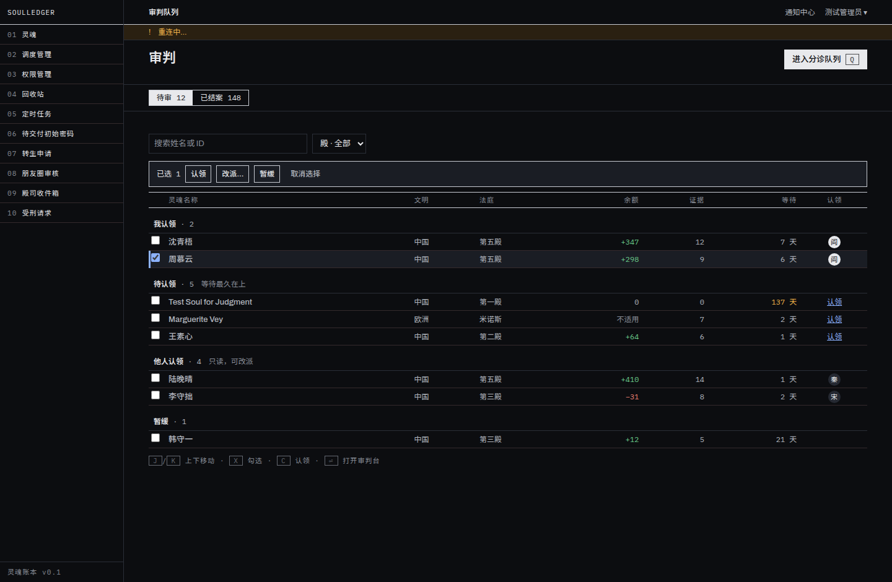
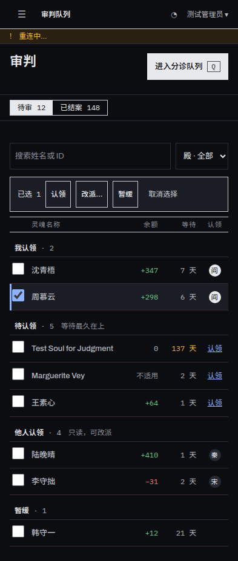
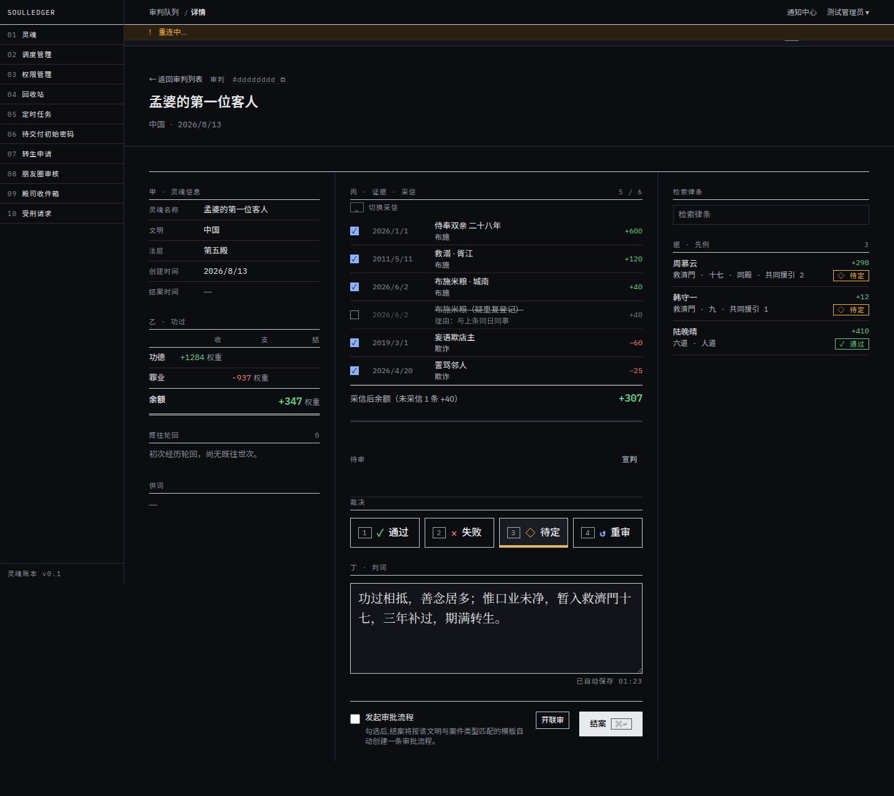
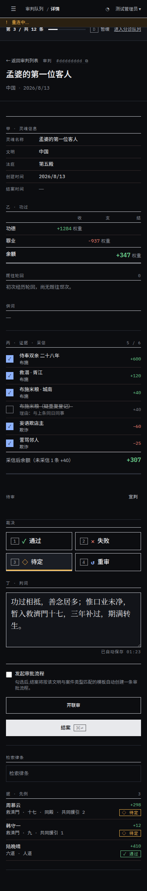
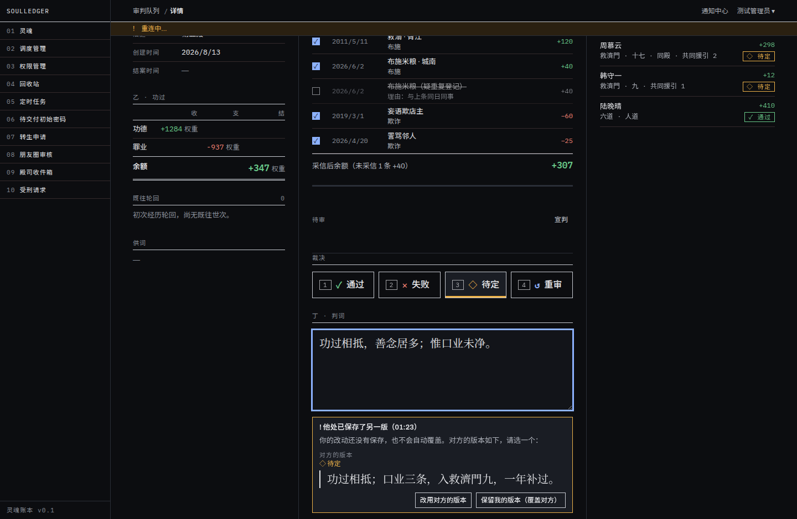
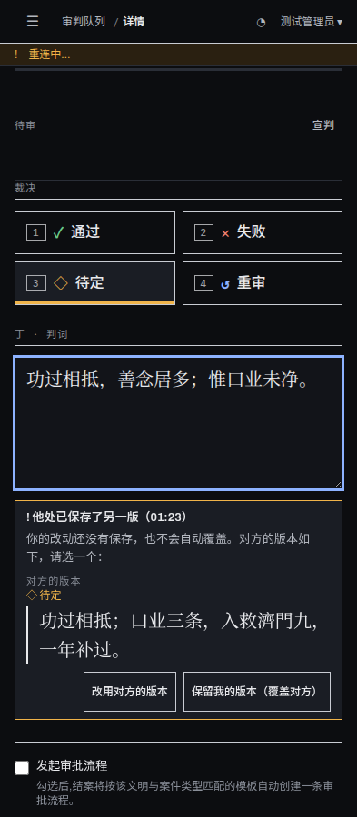
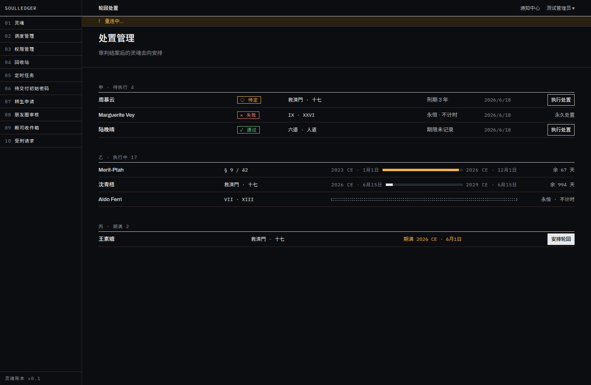
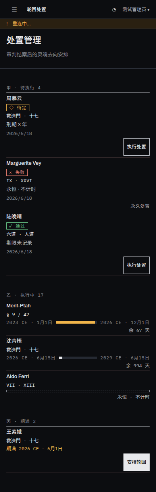

# web-judgment-wiring: 审判队列 / 审判台 / 处置接上新后端

Branch `feat/web-judgment-wiring`, from `main` @ `638929e`. Frontend only. No backend changes.
Node **22.22.2** (20.19.5 was not installed in this container). Dependencies from `npx -y npm@11 ci` plus
`npm rebuild …`, and `package-lock.json` restored afterwards (it is unchanged in the diff).

## 1. 审判队列 `/judgment`

**Built**
- The 「待审」 tab has four groups: 我认领 / 待认领 / 他人认领 / 暂缓. Each group is one `?group=` query, paged separately, ordered `created_at` (longest wait first). GroupHeader counts come from `GET /judgment/queue-counts/` with the same `search` / `court` filters, **not** from the number of rows on the page. The 「已结案」 tab is still the flat table.
- Rows are 28 px (`h-7`) and 44 px at ≤640 px. The whole row links to the desk.
- ClaimAvatar is round (the spec's avatar exception). It lives in its own file, `ClaimAvatar.tsx`, and only that file is added to `ROUND_ALLOW` in `eslint.config.mjs`. Your own claims render ink-filled. The accessible name is the full name.
- Unclaimed rows get a 「认领」 link (not on 暂缓 rows).
- Keys, all ignored while typing: **J / K** move focus between row links, so ⏎ is the link's own Enter. **X** ticks the focused row. **C** claims the focused row. **Q** is unchanged.
- Checkbox column and batch bar (认领 / 改派… / 暂缓 / 取消选择) appear only with `judgment.execute`. 改派 appears only with `judgment.assign`. A batch is capped at 100 ids. A refusal toasts a translated message keyed on the refusal `code`; the server's English text is never shown.
- 暂缓 requires a reason: blank is refused client-side, the reason is trimmed, max 500. 改派 lists active officers from `/users/`, filtered to your own tenant (ADMIN has no tenant, so the list shows everyone with a tenant label).
- Search (300 ms debounce), a 殿 filter, and balance and evidence columns. A null `karmic_balance` shows 「不适用」, not 0.

**Skipped / limits**
- 殿 options: there is no endpoint that lists courts. `court` is free text with an exact match, so the options come from the courts in the loaded rows plus the one currently selected.
- The civilization and sort dropdowns from the canvas were not built (the task asked for search + 殿 only).

## 2. 审判台 `/judgment/[id]`

**Built**
- **丙 · 证据 · 采信**: the current life's MERIT/DEMERIT records from `/souls/{id}/karma/`, which are the same records `EvidenceAdmissionService.rule` accepts. The header shows 「采信 n / N」. Each row's focus target is a `role="checkbox"` **button**, so Space on the focused row is the button's native activation. There is no extra key listener, so nothing toggles twice and nothing fires while typing (see the note below). Admitted → not admitted opens a required-reason dialog. Not admitted → admitted is sent directly. A not-admitted row shows strikethrough plus its reason. 「采信后余额（未采信 N 条 ±X）」 and the figure come from the server's `admitted_balance`. A null balance shows 「不适用」. `NOT_CURRENT_LIFE` hides the rows and says why. Once concluded, the rows are read-only.
- `evidence_json` (the case's own free-form record) now shows below 丙, without the 丙 mark, and only when the case has any.
- **丁 autosave** (`JudgmentDraftAutosave.tsx`):
  - It saves only after the operator edits the text or picks a verdict, 1.2 s after the last change.
  - It sends the `draft_version` read from the query cache, not a stale closure.
  - It shows 「已自动保存 HH:MM」 from the server's `draft_saved_at`, plus saving and failed states. A failure retries on the next edit, not in a loop.
  - **On 409 `draft_conflict`**: autosave stops and a banner shows the server's text and verdict with two choices. 「改用对方的版本」 replaces the text and verdict. 「保留我的版本（覆盖对方）」 re-saves on the server's version number, which is an explicit overwrite. While the banner is up, the saved-time line is hidden, because that time belongs to their version, not to the text in the box.
  - On 409 `concluded` it refetches, and the page freezes.
  - The saved `draft_verdict` preselects the verdict. The `notesTouched` guard is untouched, and `JudgmentDetailPage.notesDraft.test.tsx` passes unmodified.
- **据 · 先例**: from `/judgment/{id}/precedents/`, in the server's order. Name links to the case, then balance, verdict glyph badge, realm, 同殿, and 共同援引 n.
- **QueueBar D** opens the defer dialog with a required reason. It works only while the bar is shown and with `judgment.execute`. A deferred case shows 「已暂缓：reason」 at the top of the 判 column.
- **Frozen after conclusion**: no toggles, no autosave, no verdict keys.
- **Conclude timing unchanged**: no 5-second undo.

**Skipped**
- **J / K previous / next**: there is no positional API. `next/` returns only "the next pending case". **S 跳过** is also not built: it exists only in the `/judgment/queue` console session.
- Destination / term (戊) is not built: `conclude/` still takes neither.

**Bug caught by a new test during this work (fixed before commit):** 「保留我的版本」 originally merged the server's whole draft into the cache, so the page's seeding effect silently switched the verdict to *theirs*. It now adopts only `draft_version`.

## 3. 处置 `/disposition`

**Built**
- Three sections, each a `?section=` query paged on its own. Each section header shows that query's server `count`, not the rows on the page.
- 期满 uses `soul_reborn=false`, so souls already reborn are hidden.
- The client-side expiry computation is gone: `sectionOf` is deleted. `dispositionTerm.ts` now only computes the TermBar fill, from `term_start` to the server's `term_end`. A row past its end that the daily check hasn't flagged yet stays in 执行中 with a full bar and 「余 0 天」.
- A verdict column on 待执行 shows ✓ ✕ ◇ ↺ with names, via `verdictGlyph.ts`. A missing verdict shows 未记录.
- Row-end actions appear only in 待执行 (执行) and 期满 (安排轮回), per spec rule 15. Eternal dispositions render as a dashed box.

**Skipped / limits**
- 「下次自动期满检查 · 今日 24:00」: `disposition.expire_due` is not in any schedule, so there is no source for the next run time.
- 执行中 「期满近 → 远」 is sorted within the page only, because list `ordering` accepts only `created_at` / `executed_at`.
- Eternal 待执行 rows still show 「永久处置」 instead of 执行. This is existing behaviour, left unchanged.

## Backend issues (reported, not fixed)
1. **MODERATOR cannot pick a reassign target.** `judgment.assign` is granted to MODERATOR, but `/users/` requires what only ADMIN holds, so the picker gets a 403. The UI says so rather than showing an empty dropdown. The fix is an "assignable officers" endpoint, or `user.read` scoped to the tenant.
2. No endpoint lists courts for the 殿 filter.
3. `disposition.expire_due` is not scheduled anywhere, so 期满 only fills if something runs it.

## Gates (final tree, Node 22.22.2)

| Gate | Result |
|---|---|
| `npx tsc --noEmit` | exit 0 |
| `npm run lint` (`--max-warnings 0`) | exit 0 |
| `npm run test:coverage` | exit 0 · **182 suites / 3006 tests passed** · all files 79.83 / 71.52 / 70.06 / 80.86 |
| `npm run build` | exit 0 |
| playwright chromium | exit 0 · **142 passed** |
| playwright mobile-chrome | exit 0 · **142 passed** |
| playwright firefox | **not run**: no Firefox in `/opt/pw-browsers`, and installing browsers is not allowed here |
| core typecheck / lint / test | exit 0 / 0 / 0 · **122 tests passed** |

- Playwright ran against the pre-installed Chromium 1194 through a throwaway config (not committed), because the repo's Playwright expects headless-shell 1243.
- The E2E runs happened before four unused i18n keys were removed. That removal touched only the bundles; tsc, lint, coverage, build and the core tests were re-run after it.

**New checks proven to fail.** Each was mutated, the suite went red, and the code was restored:
- group count read from rows instead of the server
- 期满 losing `soul_reborn=false`
- a silent overwrite on 409
- 「保留我的」 adopting their whole draft
- defer accepting a blank reason
- client-side expiry reintroduced
- the saved-time line shown during a conflict
- the E2E Space test with a dead toggle (rebuilt, and it failed)

**Other changes**
- `e2e/fixtures.ts` now models `queue-counts/` and `precedents/`, so the "ApiMock covers what the app calls" gate stays honest.
- New i18n keys are in all three bundles. egy uses only registered word forms: the regenerated `egyVocabulary.json` changes counts only, with no new words.
- `app/judgment/[id]/page.tsx` grew by about 60 lines. The new logic lives in components; the page was not split.

## Screenshots (sample data through the E2E API mock; dark theme)

| | 1440 | 393 |
|---|---|---|
| 审判队列 |  |  |
| 审判台 |  |  |
| 审判台 · 409 冲突 |  |  |
| 处置 |  |  |
