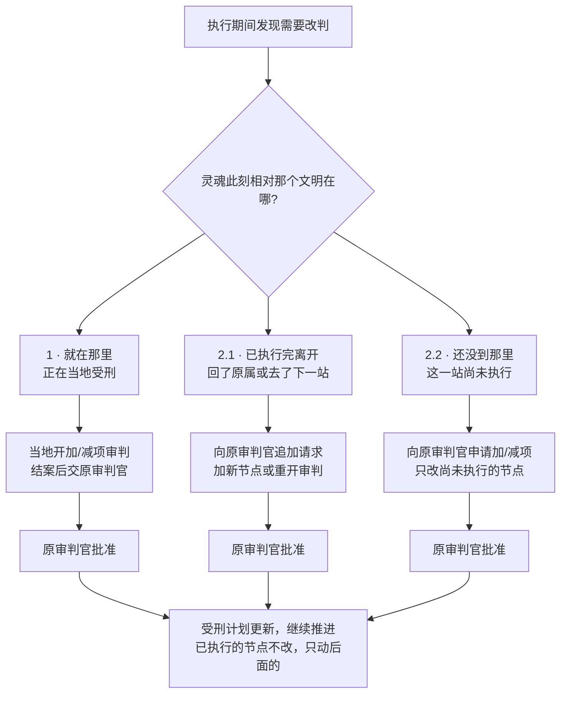
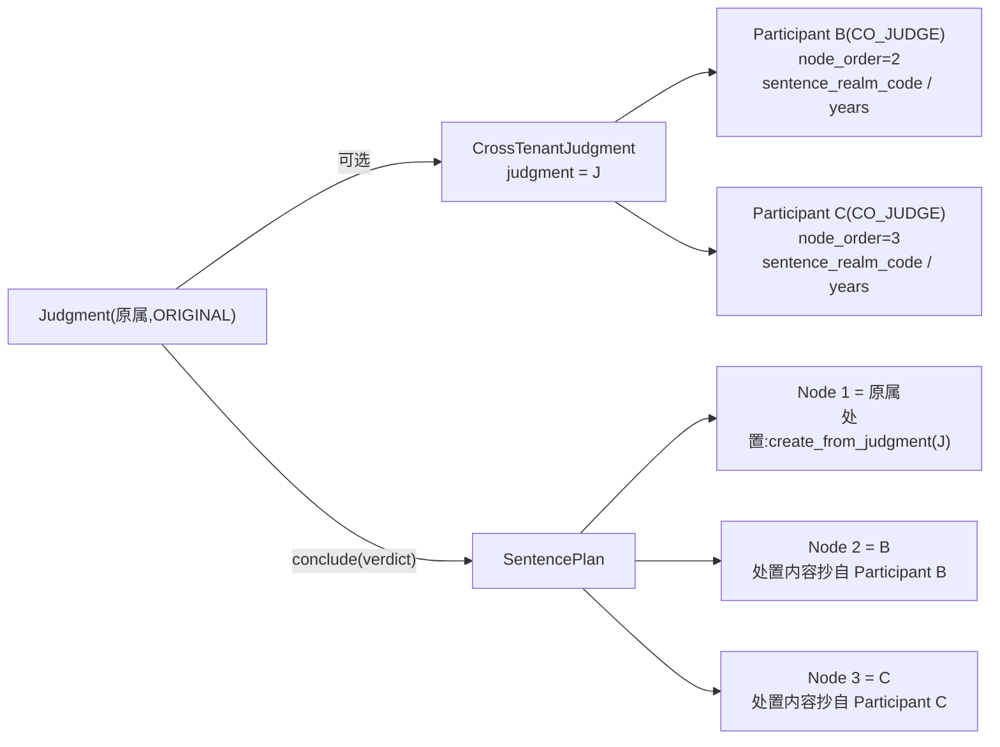
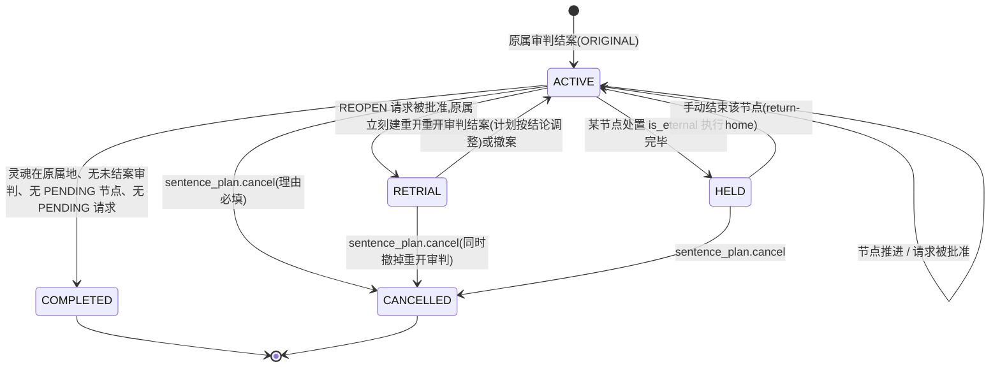
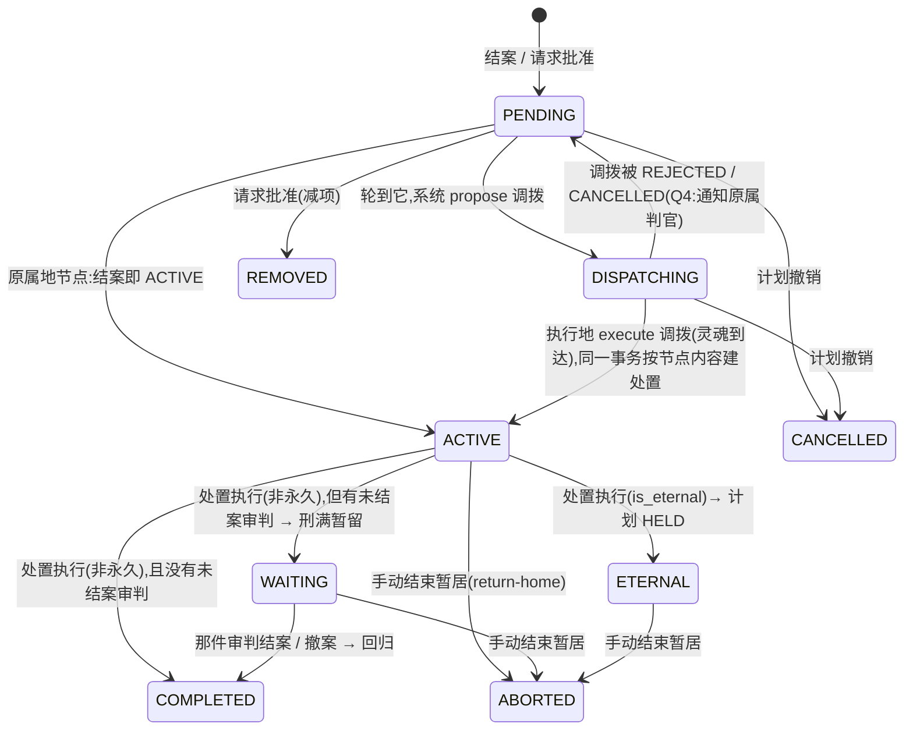

# 受刑计划(处置流程节点)—— 设计稿

> **状态:设计稿,第 10 节列出的 11 条已由用户拍板(2026-09-18);第 11 节是拍板后新出现、仍需确认的问题。**
> 基于 `main` = `0ac91b99`。「现状」每一条都写了代码出处(文件:行);没有实跑过的推断标「未核实」。
> 阶段 1(只加模型、行为不变)可以在第 11 节拍板之前实施;阶段 2 起要等它。

## 决策记录(2026-09-18 用户拍板;Q13–Q17 于 2026-09-19 用户确认)

| # | 决定 |
|---|---|
| Q1 | **外地节点的处置内容在跨文明联审(cross-judgments)时就确定。** 受刑计划的节点序列与每个节点的处置内容(界域 / 刑期)由联审结论产出;各参与文明的判官在联审中定**自己文明那一节点**的内容(避开跨宇宙观引用)。单文明审判 = 只有原属一个节点的退化情况。 |
| Q2 | 情况 1(灵魂在场、当地开加 / 减项审判)**结案后须原审判官批准才生效**(走 `SentencePlanRequest`)。**补充(同日):情况 2.2 的加 / 减项同样由原审判官批准** —— 三种情况都走 `SentencePlanRequest`,都由原审判官批。 |
| Q3 | 计划 ACTIVE 时手动发起调拨 → **拒绝**,提示走计划;无计划的灵魂照旧可手动调拨。 |
| Q4 | 系统发起的调拨被执行地拒绝 → **节点退回 PENDING,通知原属判官**。 |
| Q5 | **联审结论时就拒绝「永久刑期节点后面还有节点」的排法**(处置内容在联审时已定,可以校验)。 |
| Q6 | 转世申请**计划全部完成才开放**;已提交过的申请照常可申诉。 |
| Q7 | 原审判官批准「重开审判」后**立刻在原属地开审**,即使灵魂在外地。用户澄清:流程是「先结案 → 执行 → 执行期间如需要再重开」,原审判在执行前已结案,所以执行期间**至多一件未结案审判(即重开的那件)**,「一个灵魂同时只能有一个未结案审判」**不冲突,不按租户 / 计划区分唯一性**。需要的只是一个**窄的写例外**:原属租户可为暂居在外的灵魂开这件重开审判(只限此操作,集中实现、并入租户隔离契约)。**重审期间外地执行不受影响**;若当前节点刑满时重审还没结案,灵魂**在当地暂留等待**(不回原属、不推进),重审结案并调整计划后再继续;暂留状态官员端与灵魂端都可见,有事件与通知。见 §4.3。衍生一条待确认(§11 N1)。 |
| Q8 | `feat/notify-judges` 不合并,并入阶段 2。 |
| Q9 | **新增专门的事件类型 `EventType.SENTENCE_*`**(含迁移;`SoulPushHandler` 相应识别)。 |
| Q10 | 灵魂端可见**全部节点与各自处置**(不含理由、判官、请求)。 |
| Q11 | 计划撤销要做,放在加减项那一阶段(阶段 3)。 |
| Q12 | **联审模型的补齐放进阶段 1**:`CrossTenantJudgment` 挂灵魂 / 审判,参与方带节点内容(文明、顺序、界域 / 刑期等),以及「永久刑期只能排最后」的校验。用户已看过按本设计画的三张流程图(主流程、三种改判、重审与暂留)并确认。 |
| Q13 | **(2026-09-19 用户确认)回填遇「原属处置未执行、灵魂已被调去外地受刑」:原属节点记 PENDING**,灵魂回来后再执行,与「回原属地检查剩余节点」一致。「外地受刑」= 后面某节点为 ACTIVE / WAITING / DISPATCHING / ETERNAL。PENDING 不在「在路上或受刑中」之列,写出的计划满足该约束。其余仍违反约束的形状(正常流程产生不了)不写、只报。见 §7.2。 |
| Q14 | **(2026-09-19 用户确认)§2.3 两条部分唯一约束按意图放宽**:「一个灵魂至多一份进行中计划」含 RETRIAL;「一份计划至多一个在路上或受刑中的节点」含 WAITING。两个状态都是 Q7 之后才加的,约束原文写于它们之前。 |
| Q15 | **(2026-09-19 用户确认)结论为 FAIL 的联审照跑 §2.3 的结束校验,但不抄节点**:阶段 2 原属结案抄参与方节点时只抄 PASS 的联审。 |
| Q16 | **(2026-09-19 用户确认)§11 N3 定为 (a)**:CO_JUDGE / CHAIRMAN 必须带节点并填处置,ADVISOR 不带也不能填。 |
| Q17 | **(2026-09-19 用户确认)原审判 `conclude/` 遇未结束的联审答 409 `cross_judgment_open` 放在阶段 2**,与「原属结案抄参与方节点」一起做;阶段 1 不改原审判结案行为。 |

## 0. 用户的原话(权威需求)

> 正常来说应该是没有这种的,假设这个灵魂属于 A,被判需要 ABC 三地执行(BC 的执行顺序审判时候确定,假设是 BC 的顺序),那优先执行原属地,然后 B,完成后回到 A,检查还有嘛,有 C,那就去 C,完成后回 A,再次检测没有,那就允许转世申请。
>
> 未结案审判,只有可能 3 种情况,先分成两个大类,该灵魂在不该审判地点:1,在的话,那就加项或减项审判;2.1,若不在,会分两个情况,已经在当前地区执行完毕回到原属地(结案或者到下一个地区去受刑了),那就像该案判官追加请求,根据情况,增加受刑节点,或者再开一次审判;2.2,若不在当前区域,且还没到本区域执行,那就通过递交给判官申请,申请加项或减项审判。
>
> 话说受刑其实也应该有流程节点的吧,会好设计一点?
>
> (关于 Q1)审判时候不是联合审判嘛,审判时候确定了。

一句话:**联审结论生成一份有序的受刑计划,每个节点的处置内容由该文明的判官在联审里定;原属地节点先执行;每执行完一个节点回原属地,系统检查剩余节点,有则调往下一个,无则开放转生申请。现有「调拨 = 暂居」变成计划里的搬运层;三种未结案情况变成对计划的三种操作,全部经原审判官批准。**

---

## 0.1 用户确认的流程图(2026-09-18)

以下三张图经用户逐张确认，是本设计的**行为基准**:后续章节(状态机、推进规则、实施)与它们冲突时以图为准，改图须用户再确认。
图 2 已按用户决定修正:**情况 2.2 同样由原审判官批准**。

### 图 1 · 主流程

```mermaid
flowchart TD
    A[灵魂死亡 · 原属文明审判中] --> B["联合审判结案<br/>定下每一站去哪、受什么刑<br/>原属地第一站 · 永久刑期只能排最后"]
    B --> C[生成受刑计划(有序节点)]
    C --> D["执行当前节点<br/>在该文明按联审定的处置执行"]
    D --> E{"回到原属地，检查<br/>还有没执行的节点吗?"}
    E -- 有 --> F["调往下一站<br/>系统自动发起调拨"]
    F --> D
    F -. 被执行地拒绝 .-> G["节点退回待执行<br/>通知原属判官"]
    E -- 没有 --> H["计划全部完成<br/>开放转世申请"]
```

回原属地时依次检查(前一项不满足就停):① 无未结案审判(执行期间只可能是重开的那件)② 无待原审判官决定的改判请求 ③ 有无未执行节点 —— 无则计划完成(可转世文明 → 轮回中并开放转世申请;不可转世 → 已结算),下一站在外地则系统发起调拨，在原属地则直接建处置。
计划进行中官员不能手动调拨，只能走计划。

### 图 2 · 执行期间改判的三种情况



### 图 3 · 重开审判与暂留等待

```mermaid
flowchart TD
    subgraph 原属地
        R1[原审判官批准重开审判] --> R2["原属地立刻开审<br/>灵魂在外地也可以开"]
        R2 -. 审理中 .-> R3[重审结案]
        R3 --> R4[按结论调整受刑计划]
        R4 --> R5["回原属地检查剩余节点<br/>继续下一站或开放转世"]
    end
    subgraph 暂居地(灵魂此刻所在)
        X1["当前节点照常执行<br/>重审不打断外地执行"] --> X2{"外地刑期结束<br/>重审结案了吗?"}
        X2 -- 没结 --> X3["灵魂在当地暂留等待<br/>官员端与灵魂端都可见"]
        X2 -- 已结 --> X4[回原属地]
        X3 --> X4
    end
    R3 -. 放行 .-> X3
    X4 --> R5
```

执行期间至多一件未结案审判(原审判在执行前已结案)。原属地为暂居灵魂开重审只需一个**窄的写例外**(仅此操作),与暂居只读例外集中实现。

## 1. 现状(代码实测)

### 1.1 已经有的、要保留的

| 事实 | 出处 |
|---|---|
| 调拨是暂居:`Soul.tenant` 是此刻管辖,`Soul.home_tenant` 是原属;`tenant != home_tenant` 即暂居 | `apps/souls/models.py:272-288`、`:396-399`(`is_residing`) |
| 调拨状态机 `PROPOSED → APPROVED → EXECUTED → RETURNED`,另有 REJECTED / CANCELLED;每个灵魂同一时刻至多一条 PROPOSED/APPROVED(部分唯一约束) | `apps/dispatch/models.py:13-21`、`:90-96`、`:109-116` |
| 执行调拨 = 灵魂行锁下切 `tenant`,写 `SoulEvent(STATE_CHANGED, action=DISPATCH_EXECUTED)` | `apps/dispatch/services.py:231-281` |
| 暂居结束 `end_residence`:灵魂行锁 → 问 `open_judgments` → 有未结案则抛 `ResidenceReturnBlockedError` 什么都不写 → 否则 `tenant` 回 `home_tenant`、调拨记录 → RETURNED、写事件与审计 | `apps/dispatch/services.py:304-369`;异常定义 `:17-31` |
| 暂居中的灵魂**不能再被调拨**(保守默认,注释写明「待用户确认」) | `apps/dispatch/services.py:59-66` |
| 暂居租户的处置执行完毕 → 自动回归;永久刑期(`is_eternal`)不回归;被未结案审判拦下则记 `DISPATCH_RETURN_BLOCKED` 事件、每次暂居只通知一次 | `apps/disposition/services.py:755-802`;`apps/dispatch/services.py:371-411` |
| 撤案后补回归的启发式:「本次暂居开始以来暂居租户有一份**已执行、非永久**的处置,且没有未执行的处置」 | `apps/dispatch/services.py:448-483`;由 `Judgment.delete_or_raise` 调用 `apps/judgment/models.py:142-156` |
| 手动结束暂居 `return-home/`:只有原属租户或 ADMIN;理由必填;被未结案审判拦下答 409 + `code=open_judgment` + id 列表 | `apps/dispatch/views.py:341-380`;`apps/dispatch/serializers.py:180-182` |
| 「回归被拦下」通知收件人 = 原属与暂居两个租户里持有 `dispatch.read` 的在职官员(JUDGE 不持有,不收) | `apps/dispatch/services.py:413-446` |
| 暂居只读例外:原属租户对暂居灵魂及暂居地写在它身上的审判/处置/事件**只读**可见;纳入清单钉在契约测试里 | `apps/core/tenant.py:122-195`;`tests/test_tenant_scoping_contract.py:117-156` |
| 暂居中不进轮回也不进终局;转生资格/申请/申诉一律按原属文明 | `apps/souls/models.py:565-573`、`:575-588`;`apps/soul_accounts/rebirth.py:19-21` |
| `Judgment` 没有状态列;「未结案」= `verdict IS NULL AND is_final=False AND is_deleted=False`;一个灵魂同时只能有一个未结案审判(**序列化器层**,没有数据库约束) | `apps/judgment/models.py:28-42`;`apps/judgment/serializers.py:130-150` |
| 审判结案是一个 saga:引条文 → 写裁决 → `DispositionService.create_from_judgment` → 可选建工作流 → 灵魂 `JUDGING → DISPOSED` → 事件;**灵魂进不了 DISPOSED 则整体回滚** | `apps/judgment/services.py:153-217` |
| 处置按**管辖文明**(`soul.civilization`,即当时的 `tenant`)路由到 realm;`is_eternal` / `memory_reset` 抄自 realm | `apps/disposition/services.py:120-167`、`:170-237` |
| 处置执行(原属):灵魂 `DISPOSED → REINCARNATING`(有来世)或 `→ SETTLED`(终局),按**原属文明** | `apps/disposition/services.py:667-753` |
| **跨文明联审 `CrossTenantJudgment`**:`title / description / initiating_tenant / status(PROPOSED→ACTIVE→CONCLUDED\|CANCELLED) / conclusion_type(PASS\|FAIL)`;参与方 `CrossTenantJudgmentParticipant(participant_tenant, participant_actor, role ∈ ADVISOR\|CO_JUDGE\|CHAIRMAN)`。**没有 `soul` 字段,没有与 `Judgment` 的任何关联,参与方没有任何结论字段**;`conclude` 只写 `conclusion_type` 并通知参与方 | `apps/dispatch/models.py:139-262`;`apps/dispatch/services.py:486-625`;`apps/dispatch/serializers.py:312-330` |
| 联审的权限族 `cross_judgment.read / .create`,持有者 ADMIN / JUDGE / MODERATOR;只有发起方能 seat 参与方与 activate;发起方或任一参与方可 conclude | `apps/dispatch/views.py:393-625`;`apps/perm/models.py:338-339` |
| 灵魂推送:调拨批准 / 暂居开始 / 回归三种 kind,由 `SoulEvent.post_save` 信号接(不经总线);文案权威在 `packages/core/messages/*.json`,后端副本由测试逐字钉住 | `apps/soul_push/services.py:80-118`;`apps/soul_push/signals.py`;`apps/soul_push/messages.py:1-23` |
| 官员通知的多语言文案同一套办法;目前只有 `dispatch_return_blocked` 一种 | `apps/notifications/messages.py:11-36` |
| App 显示「暂居 X · 原属 Y」;皮肤跟当前文明,词表跟原属 | `mobile/src/rules.ts:181-188`;`mobile/src/screens/life.tsx:278-283`;`/me` 给出 `home_tenant`、`is_residing`:`apps/soul_accounts/serializers.py:69-72` |
| 审批工作流:`ApprovalWorkflow.tenant` 单租户;节点审批人按 ACTOR / ROLE / SYSTEM,`can_approve` 失败即拒;有条件路由 `on_pass` / `on_fail`;终态只有 COMPLETED / REJECTED | `apps/workflow/models.py:148-153`、`:665-740`、`:609-624`、`:31-34` |
| 行锁写法:`select_for_update(of=("self",))`;pytest 插件在 SQLite 上也拦「锁语句连带关联表却没写 `of=`」 | `apps/core/lock_join_guard.py:1-25` |
| PG 专属并发测试 7 条 `skipif(SQLITE)`,集合被 `test_the_postgres_only_set_is_the_set_we_think_it_is` 钉住 | `tests/test_concurrency.py:109-639`、`:851` |
| 提交的 OpenAPI 文档必须与后端生成的一致;core 的 `schema.ts` 由它生成 | `tests/test_committed_schema_matches_the_backend.py`;`packages/core/package.json:37` |

### 1.2 现有机制里与本需求冲突或缺失的(设计要解决的点)

| # | 事实 | 出处 | 影响 |
|---|---|---|---|
| G1 | **暂居租户经真实 API 结不了案。** `conclude` 要求灵魂 `JUDGING → DISPOSED`,而 `DISPOSED` 的合法去向只有 REINCARNATING / SETTLED / LOST;暂居灵魂到达时已是 DISPOSED,暂居地新开的审判 `conclude/` 会得到 400 `JudgmentNotConcludableError`。**暂居测试全部绕开 `conclude/`**:直接 `Disposition.objects.create(...)`(`test_dispatch_residence.py:64-65`)和 `Judgment.all_objects.update(verdict=..., is_final=True)`(`:306-307`)。 | `apps/judgment/services.py:205-211`;`apps/souls/models.py:487-489` | 「加项 / 减项审判」是在 DISPOSED 灵魂身上结案的审判,现状不可达。未实跑 API,按代码路径推断(**未核实**)。 |
| G2 | 联审今天是一场**不挂灵魂、无结论内容**的会议(§1.1 联审那行)。 | `apps/dispatch/models.py:139-169` | Q1 要它产出节点与处置内容,缺三样:挂到哪份审判、每个参与方的节点内容、结论校验。 |
| G3 | `Disposition.judgment` 是 `OneToOneField(null=True)`,`can_delete` 在 `judgment is None` 时为 **True**。 | `apps/disposition/models.py:49-54`、`:178-184` | 节点生成的处置(没有本地审判)会变成可删。 |
| G4 | 「回原属地后检查剩余」现状由启发式 `resume_return_after_case_closed` 近似,不是显式状态。 | `apps/dispatch/services.py:448-483` | 计划落地后删掉这段启发式,用节点状态回答。 |
| G5 | 转生资格 `SOUL_STATES_THAT_MAY_APPLY = ("JUDGING", "DISPOSED")`:**审判未结、处置未执行、暂居中**都能提交申请;`test_a_chinese_soul_residing_in_egypt_may_still_apply_and_home_reviews_it` 钉住「暂居中仍可申请」。 | `apps/soul_accounts/rebirth.py:52`、`:62-83`;`tests/test_dispatch_residence.py:585` | Q6 已拍板:改。 |
| G6 | 撤案后补回归靠 `delete_or_raise` 里的钩子;结案后回归靠「conclude 总会在暂居租户新建一份未执行的处置」(注释原话)—— 而 G1 说那个 conclude 走不通。 | `apps/dispatch/services.py:452-456` | 这段注释描述的是一条不存在的路径。 |
| G7 | `end_residence` 在灵魂行锁下问 `open_judgments`,但**开新审判不锁灵魂行**(注释 `ponytail:`),并发时可能漏看刚建的审判。 | `apps/dispatch/services.py:326-328`;`apps/judgment/views.py:118-137` | 计划推进用同一把锁,一并补上。 |
| G8 | 工作流 `announce` 只通知 `approver_actor`,按 ROLE 指定的节点**没人被通知**。 | `apps/workflow/services.py:597-609` | 追加请求不走工作流的理由之一(§4.4)。 |
| G9 | `EventType` 声明了 `DISPATCH_*` 成员(`:36-40`)却没有任何一处写入它们:调拨全部事件都是 `STATE_CHANGED` + `payload.action`;`SoulPushHandler.should_handle` 只认 `HANDLED_EVENTS` 三种。 | `apps/events/models.py:12-40`;`apps/dispatch/services.py:101`、`:262`、`:354`;`apps/soul_push/services.py:120` | Q9 已拍板:加 `SENTENCE_*` 成员并让处理器认。 |
| G10 | 本地分支 `feat/notify-judges`(1 提交 `1a1d0d62`,2 文件 +25/−4,新增 1 条测试):给「回归被拦下」通知加上**暂居地**持有 `judgment.execute` 的判官。 | `git log main..feat/notify-judges` | Q8 已拍板:不合并,并入阶段 2(§7.3)。 |
| G11 | 「一个灵魂同时只能有一个未结案审判」只在序列化器里(`validate_soul`),ADMIN 免检;**没有数据库约束**。 | `apps/judgment/serializers.py:130-150` | 规则本身**不变**(Q7 澄清);可选加固:把它落成部分唯一约束 `UniqueConstraint(fields=["soul"], condition=Q(verdict__isnull=True, is_final=False, is_deleted=False))`,与 G7 一起在阶段 3 做。 |

### 1.3 分库约束(2026-09-14 用户拍板,`docs/ARCHITECTURE-soul-app-and-domain-split.md:10-11`、`:29`)

新表 **UUID 主键、不加跨租户外键、跨文明动作走事件**。现有 `DispatchRecord.source_tenant / target_tenant`、`CrossTenantJudgmentParticipant.participant_tenant` 都是跨租户外键(同文档 §4 列为分库代价),本设计**不再增加这类外键**:节点上的执行地用 `tenant_code` 字符串,节点引用的处置 / 调拨记录 / 审判用裸 `UUIDField`;联审参与方新增的字段里 realm 用 `realm_code` 字符串(`Realm.realm_code` 全局唯一,`apps/realms/models.py:56`),不用外键。

---

## 2. 领域模型

### 2.1 计划从哪里来(Q1)



- **原属审判 `Judgment` 仍是主干**:它的 `conclude/` 是唯一生成计划的地方。原属节点的处置照旧由 `DispositionService.create_from_judgment` 按原属文明路由。
- **联审是可选的一段**:原属判官开一份 `CrossTenantJudgment` 并挂到这份 `Judgment` 上(新列 `judgment`,同租户,可以是外键);seat 参与方时给 `node_order`;每个 `role != ADVISOR` 的参与方由**其本文明的判官**填自己节点的处置内容;联审 `conclude` 时校验(§2.3);原属 `conclude/` 时若挂着联审,要求它已 CONCLUDED,并把参与方的节点抄成 `SentenceNode`。
- **没有联审 = 退化情况**:计划只有原属节点。存量数据全部是这种。
- **参与方填的是自己宇宙观的界域**:`sentence_realm_code` 必须属于参与方文明(`Realm.civilization == TENANT_CIVILIZATION[participant_tenant.code]`),与 `StatuteCitationService.resolve` 拒绝跨宇宙观引用同一立场(`judgment/services.py:55-60`)。

### 2.2 实体

```mermaid
erDiagram
    Judgment ||--o| CrossTenantJudgment : "judgment (FK,同租户)"
    CrossTenantJudgment ||--|{ CrossTenantJudgmentParticipant : "participants"
    Soul ||--o{ SentencePlan : "soul"
    SentencePlan ||--|{ SentenceNode : "plan"
    SentencePlan ||--o{ SentencePlanRequest : "plan"
    Judgment ||--o| SentencePlan : "origin_judgment_id (UUID)"
    SentenceNode ||--o| Disposition : "disposition_id (UUID)"
    SentenceNode ||--o| DispatchRecord : "dispatch_record_id (UUID)"

    CrossTenantJudgmentParticipant {
        int node_order "非 ADVISOR 必填;发起方 seat 时给,ACTIVE 前可改"
        str sentence_realm_code "参与方文明的 Realm.realm_code"
        int sentence_years "可空 = 未记录(与 Disposition 同约定)"
        bool sentence_is_eternal "抄自 realm,由服务端填"
        str sentence_memory_reset "抄自 realm,由服务端填"
        str sentence_notes
        datetime sentence_submitted_at "空 = 还没填;conclude 拒绝"
        fk sentence_submitted_by "User,SET_NULL"
    }
    SentencePlan {
        uuid id PK
        fk soul
        fk tenant "= soul.home_tenant"
        int cycle
        str status "ACTIVE|RETRIAL|HELD|COMPLETED|CANCELLED"
        uuid origin_judgment_id
        uuid cross_judgment_id "可空;退化情况为空"
        datetime completed_at
        str cancel_reason
    }
    SentenceNode {
        uuid id PK
        fk plan
        int order "1 起;原属地节点恒为 1"
        str tenant_code
        bool is_home
        str status "见 3.2"
        str realm_code "外地节点抄自参与方;原属节点抄自处置"
        int sentence_years
        bool is_eternal
        str memory_reset
        uuid disposition_id
        uuid dispatch_record_id
        uuid added_by_judgment_id "首份审判 / 加项审判 / 重开审判"
        uuid added_by_request_id
        uuid removed_by_request_id
        str reason "官员可见,灵魂不可见"
        datetime activated_at
        datetime completed_at
    }
    SentencePlanRequest {
        uuid id PK
        fk plan
        str from_tenant_code
        str kind "AMEND|REOPEN"
        json changes "add: [{tenant_code, realm_code, sentence_years, reason}], remove: [node_id]"
        str status "PENDING|ACCEPTED|REJECTED|WITHDRAWN"
        uuid requested_by_judgment_id "情况 1 的加减项审判;2.x 可空"
        str reason
        str decision_reason
        fk decided_by "User,SET_NULL"
        datetime decided_at
    }
```

**`SentencePlanRequest.kind` 只有两种**(Q2 让情况 1 也走请求,于是三种情况的请求内容同形):`AMEND` = 一组加 / 删;`REOPEN` = 重开审判。`changes.add[].realm_code` 由**提出方**填(它加的是自己文明的节点;若加别的文明的节点,`realm_code` 留空,由该文明在节点 DISPATCHING 前补 —— §11 N2)。

**为什么是三张新表而不是把节点塞进 `DispatchRecord`:** 原属地节点没有调拨记录;一个节点可以在调拨之前就存在(PENDING)、也可以在没有调拨的情况下被减项;`unique_active_dispatch` 是对**移动**的约束,不是对**计划**的约束。

**为什么 `SentencePlan.tenant = home_tenant`:** 计划属于原属文明,与转生申请、灵魂账号同一归属规则(`rebirth.py:19-21`、`test_tenant_scoping_contract.py:153-155`)。执行地对计划的可见性走新的「节点方可读」例外(§2.5)。

### 2.3 约束

| 约束 | 形状 | 守什么 |
|---|---|---|
| 一个灵魂同一时刻至多一份**进行中**计划 | `UniqueConstraint(fields=["soul"], condition=Q(status__in=["ACTIVE","RETRIAL","HELD"]))`(含 RETRIAL,Q14) | 两次结案并发不会生成两份计划 |
| 一份计划里节点序号唯一(活着的) | `UniqueConstraint(fields=["plan","order"], condition=Q(status__notin=["REMOVED","CANCELLED"]))` | 并发加项撞同一序号 → IntegrityError → 4xx |
| 一份计划同一时刻至多一个「在路上或受刑中」的节点 | `UniqueConstraint(fields=["plan"], condition=Q(status__in=["DISPATCHING","ACTIVE","WAITING"]))`(含 WAITING,Q14) | 推进的幂等(§8) |
| 原属地节点有且只有一个,`order=1` | `UniqueConstraint(fields=["plan"], condition=Q(is_home=True))` + `CheckConstraint(~Q(is_home=True) \| Q(order=1))` + `CheckConstraint(order__gte=1)` | 「优先执行原属地」是约束不是约定 |
| 一份计划同一时刻至多一条 PENDING 请求 | `UniqueConstraint(fields=["plan"], condition=Q(status="PENDING"))` | 原审判官一次只处理一条 |
| 一份联审里 `node_order` 唯一 | `UniqueConstraint(fields=["judgment","node_order"], condition=Q(node_order__isnull=False))` | 两个参与方不能排同一位 |
| `sentence_years` 非负 | `CheckConstraint`,同 `disposition_sentence_years_not_negative` | 同 `apps/disposition/models.py:157-161` |

**服务层校验(联审 `conclude` 与原属 `conclude/` 各跑一遍,数据库表达不了):**

- 每个 `role != ADVISOR` 的参与方 `sentence_submitted_at` 非空;
- `node_order` 从 2 起连续(原属恒 1);
- **Q5:`sentence_is_eternal=True` 的参与方必须是 `node_order` 最大的那个**;拒绝「永久之后还有节点」;
- `sentence_realm_code` 属于参与方文明;
- 挂着联审的原属审判,联审必须 CONCLUDED 才能 `conclude/`(否则 409 `cross_judgment_open`)。

### 2.4 与既有实体的关系

| 既有实体 | 变化 |
|---|---|
| `Judgment` | 加 `kind = ORIGINAL \| AMENDMENT \| REOPEN`(默认 ORIGINAL;存量全 ORIGINAL)、`amends_plan_id = UUIDField(null=True)`。**AMENDMENT 结案不建处置、不动灵魂状态**,只生成一条 `SentencePlanRequest(kind=AMEND)`(Q2);REOPEN 见 §4.3。`open_judgments` 不变(Q7 澄清:不按租户区分)。 |
| `CrossTenantJudgment` | 加 `judgment = OneToOneField("judgment.Judgment", null=True, SET_NULL)`;`conclude` 加 §2.3 校验。**存量行 `judgment=NULL`,照旧是一场会议。** |
| `CrossTenantJudgmentParticipant` | 加 §2.2 的八列;新动作 `POST cross-judgments/{id}/sentence/`(参与方本文明、`cross_judgment.create`)。 |
| `Disposition` | 加 `sentence_node_id = UUIDField(null=True, db_index=True)`;`can_delete` 改为 `judgment is None and sentence_node_id is None`(G3)。外地节点激活时按节点内容直接建(`destination_realm = Realm(realm_code)`、`sentence_years`、`is_eternal` / `memory_reset` 抄 realm),**不走** `_route_to_realm`。 |
| `DispatchRecord` | 不加列。计划推进时由系统 `propose`,`dispatched_by=None`,`reason` 写「受刑计划 <id> 节点 <order>」。 |
| `Soul` | 不加列、不加状态(理由见 §3.3)。 |
| `SoulAccount / RebirthApplication` | 不加列;`eligibility` 加一条(§6)。 |
| `EventType` | 加 `SENTENCE_PLAN_CREATED / SENTENCE_NODE_ACTIVATED / SENTENCE_NODE_WAITING / SENTENCE_NODE_COMPLETED / SENTENCE_NODE_REFUSED / SENTENCE_PLAN_AMENDED / SENTENCE_REQUEST_CREATED / SENTENCE_REQUEST_DECIDED / SENTENCE_PLAN_COMPLETED / SENTENCE_PLAN_CANCELLED`(Q9;迁移改 `choices`)。 |

### 2.5 可见性与权限

- `SentencePlan` / `SentenceNode` / `SentencePlanRequest` 的读:原属租户按 `tenant` 正常隔离;**执行地租户可读自己有节点的计划**(形状同 `DispatchRecordViewSet.get_queryset` 的「源或目标」,`dispatch/views.py:128-140`)。新视图必须进 `test_tenant_scoping_contract.py` 的两张分类表之一(`:476-486`)。
- 写:
  - 生成计划 / 加减项审判 / 重开审判的结案:随 `judgment.execute`(ADMIN / JUDGE / MODERATOR)。
  - 联审参与方填节点:`cross_judgment.create` + 对象级「参与方本文明」。
  - 请求:提出 = `judgment.execute`(提出方租户);决定 = `judgment.execute` + **原属租户**(对象级,同 `_initiator_or_403`,`dispatch/views.py:521-537`)。
  - 撤销计划:新 codename `sentence_plan.cancel`,ADMIN / MODERATOR(与 `dispatch.return` 同持有者,`perm/models.py:316`);理由必填、写审计。新 codename 要过 `apps/perm/test_codename_coverage.py`。
- **暂居写例外(Q7,唯一一条)**:原属租户可为暂居在外的灵魂开 `kind=REOPEN` 的审判(§4.3)。与只读例外同一个模块、同一张契约测试的表。
- ADMIN 的租户豁免照旧。

---

## 3. 状态机

### 3.1 计划



- **COMPLETED 是推进函数算出来的**,不是谁点出来的。
- **RETRIAL(重审中)**:原属有一件未结案的重开审判。**外地当前节点照常执行**(处置执行、刑期计算不受影响);推进暂停 —— 刑满的节点进 WAITING(§3.2),不回原属、不推进下一站。重开审判结案后 `advance` 按调整过的计划继续。
- **HELD** 对应今天「永久刑期不自动回归」(`disposition/services.py:772-773`)。Q5 保证 HELD 时后面没有 PENDING 节点(联审校验);加项请求在 HELD 下**拒绝**(要先手动结束永久节点)。
- **CANCELLED**:未执行节点全部 → CANCELLED,进行中的调拨记录 → CANCELLED(`DispatchService.cancel`),PENDING 请求 → WITHDRAWN,未结的重开审判撤案;灵魂若在外**不自动回归**(那是另一次 `return-home`)。

### 3.2 节点



**WAITING(刑满暂留)** 是 Q7 要的那个可见状态:处置已执行、灵魂却不能离开执行地,因为**某处**有一件未结案审判 —— 原属的重开审判(计划 RETRIAL),或本地的加减项审判(情况 1)。它统一了今天 `DISPATCH_RETURN_BLOCKED` 描述的情形,并给它一个节点状态,官员端与灵魂端都读得到;进入时写 `SENTENCE_NODE_WAITING` 事件、通知两地判官、推送 `sentence_waiting`。原属节点也可能 WAITING(原属处置执行完时恰有重开审判未结 —— 极少,但状态机不排除)。

**只有 PENDING 能被减项。** 已经开始的刑不能靠改计划抹掉,要终止它是 ABORTED(带理由、带审计),要否认它是撤销整份计划。COMPLETED 连 ABORTED 都不行:它是历史。

### 3.3 推进规则(`SentencePlanService.advance(soul)`,伪代码)

```
锁 Soul 行(select_for_update(of=("self",))),再锁 Plan 行
if plan.status not in (ACTIVE, RETRIAL): return
open = open_judgments(soul)                           # 不分租户,与 end_residence 同一个定义
current = 灵魂此刻所在执行地的那个节点(状态 ∈ {DISPATCHING, ACTIVE, WAITING, ETERNAL, ABORTED})
if soul.is_residing:
    if current.status == WAITING and not open.exists():
        current → COMPLETED;end_residence(...)        # 回归后递归一次 advance
    return                                            # ACTIVE 在执行、WAITING 在等、ETERNAL 永久:都等
if open.exists(): return                              # 原属有未结案(重开审判)→ 计划 RETRIAL,等它结案
if 有 PENDING 请求: return                            # 原审判官先决定
next = 首个 PENDING 节点(按 order)
if next is None:
    plan.status = COMPLETED; plan.completed_at = now
    灵魂状态: home_civilization in REBIRTH_CAPABLE → DISPOSED→REINCARNATING;否则 → SETTLED
        (即今天 DispositionService.execute 原属分支做的事,disposition/services.py:736-748)
    SENTENCE_PLAN_COMPLETED 事件 + 推送 sentence_completed
    return
if next.tenant_code == home.code:                     # 重开审判加的原属节点
    按节点内容建原属处置(sentence_node_id=next.id);next → ACTIVE;return
DispatchService.propose(home, Tenant(next.tenant_code), soul, dispatcher=None, reason=...)
next.status = DISPATCHING; next.dispatch_record_id = record.id
```

处置执行时(`DispositionService.execute` / `_execute_during_residence`)对节点的标记:`is_eternal → ETERNAL(计划 HELD)`;否则 `open_judgments(soul).exists() ? WAITING : COMPLETED`;然后 `advance`。

**回归被拦的规则不变:任一租户的未结案审判都拦住回归**(`end_residence` 现状,`dispatch/services.py:329`)。Q7 澄清后它恰好就是「暂留等待」:原属重开的审判未结时,刑满的灵魂留在外地。`test_an_open_judgment_in_the_home_tenant_also_blocks`(`test_dispatch_residence.py:293`)**保留**。

调用点(全部在既有事务内、灵魂行锁之下):

| 触发 | 现有代码位置 | 改动 |
|---|---|---|
| 原属审判结案 | `JudgmentConclusionService.conclude_judgment` 第 2 步之后 | 建计划 + 原属节点(ACTIVE)+ 外地节点(PENDING,抄联审参与方) |
| 原属处置执行 | `DispositionService.execute` 原属分支 `:732-753` | **不再直接推 REINCARNATING/SETTLED**;标节点 COMPLETED → `advance` |
| 执行地处置执行 | `_execute_during_residence` `:781-802` | 标节点 COMPLETED/ETERNAL;`advance`(它决定是否 `end_residence`) |
| 回归(自动或手动) | `end_residence` 末尾 | 手动的把节点标 ABORTED;两者都 `advance` |
| 任一审判结案 / 撤案 | `conclude_judgment`、`delete_or_raise`(替换 `resume_return_after_case_closed`) | `advance` |
| 调拨被拒 / 取消 | `DispatchService.reject` / `cancel` | 节点 → PENDING,`SENTENCE_NODE_REFUSED`,通知原属判官;不自动重试(Q4) |
| 请求被决定 | `SentencePlanRequestService.decide` | ACCEPT 时应用 changes(REOPEN 则立即建审判,§4.3);`advance` |

**灵魂 `current_state` 不加新值。** 整个计划期间灵魂保持 DISPOSED(今天暂居也是这样,`disposition/services.py:757-761`);计划完成那一刻做今天原属处置执行做的那次转移。不加新 `SoulState` 的理由与 `UNKNOWN_CIVILIZATION` 那段注释相同(`souls/models.py:97-110`):`SoulState.choices` 是多处模型字段的 `choices=`,App 的六枚徽章逐个枚举(`mobile/src/rules.ts:36-61`)。

`ReincarnationService.execute` 的原属守卫(`reincarnation/services.py:66-68`)保留;`disposition/views.py:132-152` 里那次 `ReincarnationService.execute(disposition)` 挪到 `advance` 的完成分支。

---

## 4. 三种未结案情况 → 计划操作

### 4.1 映射

X = 开审判的租户;`node_X` = X 在计划里的最后一个节点。

| 情况 | 判定 | 操作 | 谁发起 | 谁批准(Q2:全部要原审判官) | 改哪些节点 |
|---|---|---|---|---|---|
| **1. 灵魂就在 X** | `soul.tenant.code == X` | X 的判官开 **AMENDMENT 审判**(`kind=AMENDMENT, amends_plan_id`);结案时带 `plan_changes`,系统据此生成 `SentencePlanRequest(kind=AMEND, requested_by_judgment_id)` | X 的判官 | **原属判官 ACCEPT / REJECT** | ACCEPT:`add` 插在**当前节点之后**,序号顺延;`remove` 只允许 PENDING |
| **2.1 灵魂已在 X 执行完毕、走了** | `node_X.status in (COMPLETED, ABORTED)` 且 `soul.tenant.code != X` | X 的判官直接提交 `SentencePlanRequest(kind=AMEND \| REOPEN)` | X 的判官 | 原属判官 | AMEND:追加 PENDING 节点到队尾;REOPEN:§4.3 |
| **2.2 灵魂还没到 X** | `node_X.status in (PENDING, DISPATCHING)` 或 X 不在计划里 | `SentencePlanRequest(kind=AMEND)` | X 的判官 | 原属判官 | 改 PENDING 节点(加 / 删);DISPATCHING 的节点不能删(先在调拨侧 reject,节点自动回 PENDING) |

三种情况的**请求内容同形**(`changes`),区别只在是否有一份本地审判在背后(`requested_by_judgment_id`)。

### 4.2 边界

- 情况 1 的审判未结时,灵魂**不能离开 X**(`end_residence` 的 `ResidenceReturnBlockedError` 保留,`advance` 同样先看 X 的未结案审判)。结案后生成的请求 PENDING 期间,`advance` 因「有 PENDING 请求」而等待 —— **灵魂留在 X 直到原属决定**。若 X 的节点已 COMPLETED 而原属 REJECT 了请求,`advance` 随即送灵魂回家。
- 情况 1 的审判被**撤案**:不生成请求;`advance`。
- 减项目标已 ACTIVE:400,错误里给出该节点状态。
- 一份计划同一时刻至多一条 PENDING 请求;请求方可 WITHDRAWN。
- 灵魂在 X、X 却直接提请求:400「灵魂在本地,请开审判」;灵魂不在 X 却开 AMENDMENT 审判:`same_tenant_or_404_message` 已 404。
- HELD 计划拒绝 AMEND 请求(先手动结束永久节点)。
- **审计与事件**:节点集合每次变化写 `SoulEvent(SENTENCE_PLAN_AMENDED)` 到原属租户 + `AuditLog(resource="sentence_plan")`;请求创建 / 决定各一条 `SENTENCE_REQUEST_*`,写到**提出方**租户(原属经节点方例外读得到)。

### 4.3 重开审判(Q7:批准后立刻在原属地开审,即使灵魂在外)

用户澄清后,这一节比上一版**小得多**:流程是「结案 → 执行 → 执行期间如需要再重开」,原审判在执行前已结案,所以执行期间至多一件未结案审判,就是重开的那件。**「一个灵魂同时只能有一个未结案审判」不改、不按租户区分。**

| 现有规则 | 现状 | 在重开审判上的读法 | 需要改什么 |
|---|---|---|---|
| 一个灵魂同时只能有一个未结案审判 | `validate_soul`(`serializers.py:143-149`) | **保留**。REOPEN 请求 ACCEPT 时若灵魂已有未结案审判(情况 1 的加项审判还没结),ACCEPT 答 409 `open_judgment`,请求留在 PENDING,原属判官等它结案后再批 | 无 |
| 任一未结案审判拦住回归 | `end_residence`(`dispatch/services.py:329`);`test_an_open_judgment_in_the_home_tenant_also_blocks` | **保留**,它就是「刑满暂留」的机制:重开审判未结时,外地刑满的灵魂进 WAITING,留在当地 | 无(只加节点状态与事件) |
| 原属不能给暂居在外的灵魂开审判 | `same_tenant_or_404_message`(`apps/core/tenant_fields.py:41`);`test_the_home_tenant_cannot_write_to_the_residing_soul` | **一个窄的写例外**:原属租户可在自己租户下为该灵魂开 `kind=REOPEN` 的审判,且仅当计划上有一条 ACCEPTED 且尚未开审的 REOPEN 请求。其他写路径照旧 | 例外集中写在 `apps/core/tenant.py`(与只读例外并排:`residence_write_q` / `residence_writable(obj, tenant, action)`),`validate_soul` 调它;`test_tenant_scoping_contract.py` 加一张 `RESIDENCE_WRITABLE = {"JudgmentViewSet": ("create", "kind=REOPEN", 理由)}`,并断言**没有别的**视图 / 动作声明写例外 |
| 结案要求灵魂 `JUDGING → DISPOSED`(G1) | `conclude_judgment :205-211` | REOPEN 的结案**不走**灵魂状态转移;写 verdict、按结论调整计划(§11 N1 决定是否产生新的原属节点);`advance` | AMENDMENT / REOPEN 走 `conclude_judgment` 的另一分支 |

**重审期间外地执行不受影响**:执行地照常执行当前节点的处置;刑满时因 `open_judgments` 非空进 WAITING(事件 `SENTENCE_NODE_WAITING`,通知两地判官,推送 `sentence_waiting`);重开审判结案 → `advance` → WAITING → COMPLETED → 回归 → 检查剩余 → 下一站。官员端在计划面板与调拨记录上都看到 WAITING;灵魂端 Life 屏节点列表显示「刑满暂留 · 等待重审」。

**重开审判结案产出什么**,见 §11 N1。

### 4.4 为什么请求不用审批工作流

| 维度 | 复用 `ApprovalWorkflow` | 自建 `SentencePlanRequest`(采用) |
|---|---|---|
| 租户 | 工作流单租户(`workflow/models.py:148-153`),`ApprovalWorkflowViewSet` 明确**不纳入**暂居只读例外(`test_tenant_scoping_contract.py:146-149`);请求是两租户的事 | 与 `DispatchRecord` 同形,两方各自可读 |
| 审批人 | 按 ROLE 的节点 `announce` 不通知任何人(G8);`can_approve` 只比 `user.role`,不看租户 | 对象级「原属租户 + judgment.execute」一处写完 |
| 状态 | 7 个状态 3 个不可达(`workflow/models.py:23-34`) | 4 个 |
| 收益 | 条件路由、多级 —— 请求只有一级 | — |

---

## 5. 通知与推送

### 5.1 官员站内通知(文案键进 `apps/notifications/messages.py` 与 `packages/core/messages/*.json` 的 `official_notify`,两边一致由现有测试钉住)

「判官」= 持有 `judgment.execute` 的在职用户(ADMIN / JUDGE / MODERATOR);ADMIN 只算**该租户**的(同 `return_blocked_recipients`,`dispatch/services.py:427-430`)。文案只带灵魂名、文明名、节点序号,**不带**审判 id、裁决、理由。

| 时机(事件) | 收件人 | 文案键 |
|---|---|---|
| 节点 DISPATCHING(系统 propose) | 执行地全部在职用户(现有 `_notify_target_tenant`,`:132`,不变) | 现有 `DISPATCH_PROPOSED` |
| `SENTENCE_NODE_ACTIVATED` | 执行地判官 | `sentence_node_active` |
| `SENTENCE_NODE_COMPLETED`(含 ETERNAL / ABORTED) | 原属判官 | `sentence_node_done` |
| `SENTENCE_NODE_WAITING`(刑满暂留,Q7) | 执行地判官 + 原属判官 | `sentence_node_waiting` |
| 回归被拦(现有 `DISPATCH_RETURN_BLOCKED`) | 现有规则 **+ 暂居地判官**(= `feat/notify-judges` 的规则,Q8) | 现有 `dispatch_return_blocked` |
| `SENTENCE_NODE_REFUSED`(Q4) | 原属判官 | `sentence_node_refused` |
| `SENTENCE_PLAN_AMENDED` | 每个被加 / 被删节点所在文明的判官 + 原属判官 | `sentence_plan_amended` |
| `SENTENCE_REQUEST_CREATED` | 原属判官 | `sentence_request_pending` |
| `SENTENCE_REQUEST_DECIDED` | 提出方判官 | `sentence_request_decided` |
| `SENTENCE_PLAN_COMPLETED` | 原属判官 | `sentence_plan_completed` |
| 联审参与方填完节点 / 全部填完 | 发起方判官 | `cross_sentence_submitted` |

### 5.2 灵魂推送(`apps/soul_push/services.py`;Q9 后 `HANDLED_EVENTS` 加 `SENTENCE_*`,`rule_for` 加分支)

| kind | 处理 |
|---|---|
| `residence_approved` / `residence_started` / `residence_returned` | **保留原样**(挂在调拨记录的 APPROVED / EXECUTED / RETURNED 上,计划仍用调拨搬运) |
| `disposition_executed` | 保留,**触发条件改挂 `SENTENCE_NODE_COMPLETED`**(现在挂灵魂进入 REINCARNATING/SETTLED,`:82-84`,而计划期间处置执行不再改灵魂状态);dedupe_key 用节点 id |
| 新增 `sentence_completed` | 「受刑完毕,可以申请转生」,挂 `SENTENCE_PLAN_COMPLETED`,`data.screen="Life"` |
| 新增 `sentence_amended` | 「你的受刑计划有变更,打开灵魂簿查看」,挂 `SENTENCE_PLAN_AMENDED`;不说加了哪里、为什么 |
| 新增 `sentence_waiting` | 「本站刑满,等待重审结案后回归」,挂 `SENTENCE_NODE_WAITING`(Q7) |

不推:请求创建 / 决定、节点 DISPATCHING(批准时已有 `residence_approved`)、联审进展。

---

## 6. 转生申请的开放条件(Q6)

`eligibility`(`rebirth.py:62-83`)在 `soul_state` 之后加:

```
plan = SentencePlan.objects.filter(soul=soul, cycle=account.cycle).order_by("-create_time").first()
if plan is None or plan.status != COMPLETED: return False, "sentence_in_progress", None
```

`SOUL_STATES_THAT_MAY_APPLY` 收成 `("DISPOSED", "REINCARNATING")`。冷却、申诉(`can_appeal` 不看计划,`:228-233`)、按原属文明不变;`terminal_cosmology` 判定在计划之前。拒绝码 `sentence_in_progress` 进 `REFUSALS`、语言包与 App 提示。**存量**经 §7.2 回填后,没有计划的只剩 ALIVE / JUDGING 灵魂。要改的测试:`test_dispatch_residence.py:585`(暂居中可申请 → 不可);`:629`(调拨前被驳回的申请暂居中可申诉)**不变**。

---

## 7. 与现有暂居机制的迁移

### 7.1 代码

| 现有 | 处置 |
|---|---|
| `DispatchRecord` 模型、状态机、`propose/approve/reject/execute/cancel`、两个通知 | **保留**,是节点的搬运层。`propose` 允许 `dispatcher=None`;视图 `create` 对有 ACTIVE/HELD 计划的灵魂答 400「走计划」(Q3);无计划的照旧 |
| `end_residence` | 保留;拦截规则改按所在租户(§4.3);末尾 `advance`;手动触发标节点 ABORTED |
| `record_blocked_return` / `_notify_return_blocked` / `return_blocked_recipients` | 保留;收件人 + 暂居地判官(Q8) |
| `resume_return_after_case_closed` | **删除**(G4/G6) |
| `DispositionService.execute` 原属分支 / `_execute_during_residence` | 改:标节点 → `advance` |
| `disposition/views.py:132-152` 的 `ReincarnationService.execute` | 挪到 `advance` 完成分支 |
| `return-home/`、`DispatchReturnSerializer` | 保留 |
| `CrossTenantJudgmentViewSet` | 加 `sentence` 动作;`create` 接受可选 `judgment`;`conclude` 加校验;前端 `app/cross-judgments/[id]` 加节点内容表单(阶段 4) |
| 暂居只读例外与 `RESIDENCE_READABLE` 表 | 保留;新增三张分类 |
| `test_dispatch_residence.py`(42 条)、`test_dispatch_return_blocked_notice.py`(7)、`test_soul_push_residence_approved.py`(6) | 前者约三分之一重写(夹具换成「节点激活生成处置」;`:585` 反转);后两者不变 |
| `frontend/src/__tests__/dispatchReturnHome.test.tsx`、`mobile/src/__tests__/residence.test.tsx` | 不变 |

### 7.2 存量数据回填(115 上是测试数据;要幂等)

管理命令 `manage.py backfill_sentence_plans`(与 `seed_mythology` 同一「幂等种子」惯例),**不**放进 schema 迁移的数据步骤(CLAUDE.md:PG 上失败语句中止整个事务):

1. 每个灵魂、每个 `cycle`,若存在 `verdict IS NOT NULL` 的审判且没有计划 → 建 `SentencePlan(origin_judgment_id=最早那份, cycle, tenant=home_tenant)`。
2. 原属节点:`order=1, is_home=True, tenant_code=home.code`,`disposition_id=` 该审判的处置,`realm_code / sentence_years / is_eternal / memory_reset` 抄处置;状态:`is_executed and is_eternal → ETERNAL`;`is_executed → COMPLETED`;否则 ACTIVE。
3. 每条 EXECUTED / RETURNED 的 `DispatchRecord`(按 `executed_at`)追加一个执行地节点:`dispatch_record_id`;在该租户找 `Disposition(soul, tenant, created_at >= executed_at)` 首条作 `disposition_id` 并抄内容;状态:RETURNED → COMPLETED(事件 `trigger=MANUAL` 则 ABORTED);EXECUTED 且处置已执行 → `is_eternal ? ETERNAL : COMPLETED`;EXECUTED 未执行 → ACTIVE。
4. 计划状态:有 ETERNAL 节点且灵魂在外 → HELD;灵魂 `current_state in (REINCARNATING, SETTLED, ALIVE)` → COMPLETED(`completed_at` 取状态变化事件时间);否则 ACTIVE。
4a. 原属节点仍 ACTIVE(原属处置未执行)而灵魂此刻在外地某节点(ACTIVE / WAITING / DISPATCHING / ETERNAL)→ 原属节点记 **PENDING**(Q13);此后仍有两个占位节点的形状不写,打印灵魂 id。
5. **不跑 `advance`**:回填只描述已发生的事。命令打印每类计数,第二次运行计数必须全 0(写进命令的测试)。

迁移 0036 的选择(`souls/migrations/0036_soul_home_tenant.py` 文档字符串)沿用,不重算原属。

### 7.3 `feat/notify-judges`(Q8)

不合并。其规则并入 §5.1;测试 `test_the_residence_judge_is_told_but_no_other_judge` 的三个反例(原属判官、第三文明判官、已离职判官)原样搬进阶段 2。阶段 2 合并后删分支。

---

## 8. 并发与一致性

**锁序:`Soul` → `SentencePlan` → `SentenceNode` → `DispatchRecord` / `Disposition` / `Judgment`。** 灵魂行锁已是调拨 / 处置 / 状态机的总锁(`end_residence :323`、`_execute_during_residence :782`、`transition_to :533`、`dispatch execute :249`),计划挂在它之下。

- 所有锁语句写 `select_for_update(of=("self",))`,关联对象在锁外另取(`apps/core/lock_join_guard.py`)。
- **幂等:**`advance` 是状态的纯函数;并发调用被灵魂行锁串行化;串行化失效时 `unique_active_dispatch` 与「至多一个 DISPATCHING/ACTIVE 节点」两条部分唯一约束把第二条写入变成 IntegrityError(视图翻成 4xx,同 `dispatch/views.py:199-203`)。
- **G7 补上:**`JudgmentViewSet.perform_create` 在建案前锁灵魂行。
- **G11 可选加固:**未结案审判按 soul 的部分唯一约束(与现有规则同义,只是落到数据库层)。
- 事件与通知在事务提交后发(`transaction.on_commit`,同 `soul_push/handler.py:20-35`);`SoulEvent` 与 `AuditLog` 在事务内写。

**PostgreSQL 专属测试清单**(`skipif(SQLITE)`,加进 `test_the_postgres_only_set_is_the_set_we_think_it_is` 的集合):

1. 两个官员并发执行原属处置 → 恰一条 `DispatchRecord`、一个 DISPATCHING 节点、`{200, 400}`。
2. 执行地处置执行(回归)与执行地开加项审判并发 → 要么审判建好并拦下回归,要么回归先完成、审判 404;不存在「回归了、审判却挂在执行地」。
3. 两条并发加项(请求 ACCEPT × 请求 ACCEPT 的重试)同一序号 → 一条 4xx,序号无重复。
4. 计划完成与 `rebirth.submit` 并发 → 不存在建在 ACTIVE 计划上的申请。
5. 两个执行地官员并发执行节点处置 → `{200, 400}`,节点 COMPLETED 恰一次、回归恰一次。
6. 撤销计划与推进并发 → 撤销后不再出现新的 DISPATCHING。
7. 两个租户并发给同一灵魂开未结案审判 → 恰一条(G11 约束落地后才能在 PG 上证明;落地前这条是 `validate_soul` 的竞态,写不出来)。

---

## 9. 分阶段实施

每阶段可独立合并;门禁 = CLAUDE.md 的后端四条 + 前端五条 + core 三条 + E2E 三个 project,**全部读退出码**,并在真 PG 上跑一次。

| 阶段 | 内容 | 验收 |
|---|---|---|
| **1 模型(行为不变)** | 三张表 + 约束 + 迁移;`Judgment.kind / amends_plan_id`;`Disposition.sentence_node_id` + `can_delete`;**联审补齐(Q12)**:`CrossTenantJudgment.judgment` + 参与方八列 + 约束 + `participate` 收 `node_order` + `sentence/` 动作(参与方填自己节点)+ 挂了审判的联审 `conclude` 校验(都填了、序号连续、永久在最后);`EventType.SENTENCE_*`;**结案时建计划 + 原属节点(ACTIVE),不接推进**;回填命令;只读 API(`sentence-plans/`)与两张分类表;schema 重生成 + core 类型 | `makemigrations --check`;每条约束一次变异证明;回填命令跑两次第二次计数全 0;`test_every_soul_linked_viewset_is_classified` 绿;schema 0 warning / 0 error;`test_committed_schema_matches_the_backend` 绿 |
| **2 推进** | 原属 `conclude/` 抄参与方节点(只抄 PASS 的联审,Q15),挂着未结束联审答 409 `cross_judgment_open`(Q17);`advance` 与 §3.3 全部调用点(含 WAITING);删 `resume_return_after_case_closed`;`eligibility`(Q6);Q3 拒绝;Q4 退回;§5 事件 / 通知 / 推送;`feat/notify-judges` 三个反例并入 | 重写 `test_dispatch_residence.py`;PG 测试 1、2、5;两份文案镜像测试 |
| **3 加减项与撤销** | AMENDMENT 审判结案 → 请求;`SentencePlanRequest` 端点 / 决定 / 撤回;REOPEN(按 §11 N1 的结论);`sentence_plan.cancel`(Q11);`perform_create` 锁灵魂行(G7);未结案唯一落成约束(G11,可选);重开审判的窄写例外并入租户隔离契约 | PG 测试 3、4、6、7;每种拒绝各一条 4xx 测试且**断言未写入** |
| **4 客户端** | Web:联审详情页的节点内容表单与排序;灵魂详情的计划面板;请求收件箱;App:Life 屏「我的受刑」(Q10);新推送 kind 落地页 | `tsc`、`lint --max-warnings 0`、`test:coverage` 阈值;E2E 三个 project;App 两种模拟器实测截图 |
| **5 收尾** | 删旧注释(`dispatch/services.py:452-456`);架构文档决策记录补一条;`SOUL_STATES_THAT_MAY_APPLY` 收紧 | 全量门禁 |

阶段 1 合并后系统行为**逐字节不变**(计划只是记录),这是回滚点。

---

## 10. 已拍板(见文首决策记录)

Q1–Q11 全部已决,原选项与代价见 git 历史里的上一版(`42dffd4d`)。

## 11. 拍板后仍需确认

| # | 问题 | 选项 | 推荐与代价 |
|---|---|---|---|
| **N1** | 重开审判(REOPEN)结案产出什么 | (a) 新裁决 + 一个新的原属节点(灵魂回来后执行);(b) 只允许 `plan_changes`,不写裁决 | **(a)**,「再开一次审判」按字面是一次审判,有裁决。代价:「原属节点唯一且 `order=1`」放宽为「首个节点是原属」(§4.3 表第三行);(b) 与情况 1 的 AMENDMENT 除租户外无差别,那 REOPEN 就不必是独立 kind |
| **N2** | 2.x 请求里 X 给**别的文明**加节点时,谁填那个节点的处置内容 | (a) 不允许:请求方只能加自己文明的节点;要加别处,由原属判官另开联审;(b) 允许,`realm_code` 留空,由该文明在 DISPATCHING 前补填,未补则 `advance` 停在该节点并通知 | **(a)**,与 Q1「各文明定自己节点」一致,且少一个「等待补填」状态。(b) 多一个中间态与一条通知 |
| **N3**(已定,Q16:(a)) | 联审参与方 role 与节点的关系 | (a) `role != ADVISOR`(CO_JUDGE / CHAIRMAN)必须填节点,ADVISOR 不填也不能填;(b) 所有参与方都填 | **(a)**。ADVISOR 顾问身份今天就存在(`dispatch/models.py:31-34`),让它不带节点是唯一不改现有语义的读法 |

N1–N3 都只影响阶段 2 / 3 的服务逻辑,阶段 1 的模型对三者都兼容(`kind=REOPEN` 已在枚举里;`changes.add[].realm_code` 可空;参与方八列全部可空)。

---

## 附:原话场景(A 中国、B 埃及、C 欧洲)

```mermaid
sequenceDiagram
    participant A as A 原属判官
    participant X as 联审
    participant S as 系统(advance)
    participant B as B 判官/官员
    participant C as C 判官/官员
    participant App as 灵魂 App
    A->>X: 开联审(judgment=J),seat B(order=2)、C(order=3),activate
    B->>X: sentence/(EG realm, years)
    C->>X: sentence/(EU realm, years)
    A->>X: conclude → 校验:都填了、永久在最后
    A->>S: J.conclude(verdict) → 计划 ACTIVE;节点 1=A ACTIVE,2=B,3=C PENDING(内容已定)
    A->>S: 执行 A 的处置 → 节点 1 COMPLETED;advance → propose(A→B);节点 2 DISPATCHING
    B->>S: approve;execute → soul.tenant=B;节点 2 ACTIVE;按节点内容建处置
    S-->>App: residence_started
    B->>S: 执行处置 → 节点 2 COMPLETED;advance → end_residence → advance → propose(A→C)
    S-->>App: residence_returned
    C->>S: approve;execute;执行处置 → 节点 3 COMPLETED;回归;advance → 无 PENDING → COMPLETED;soul → REINCARNATING
    S-->>App: sentence_completed
    App->>S: rebirth.submit → eligibility 通过
```
