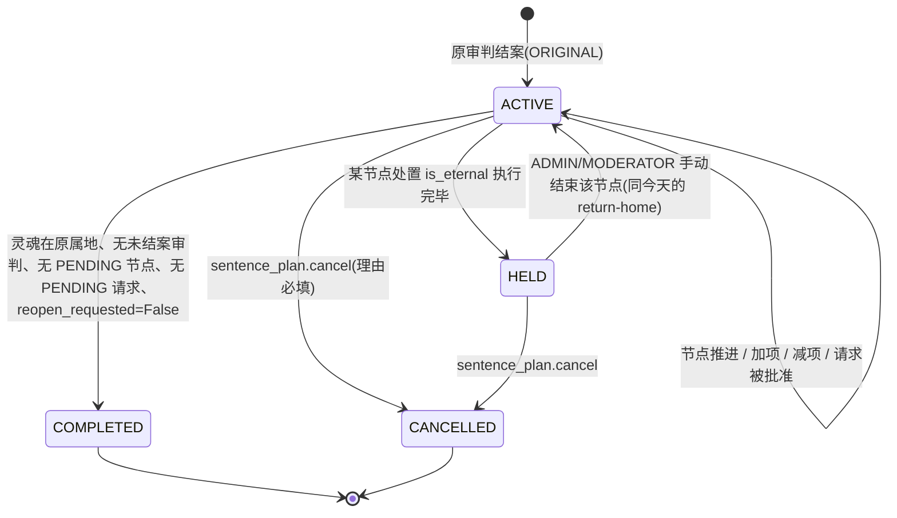
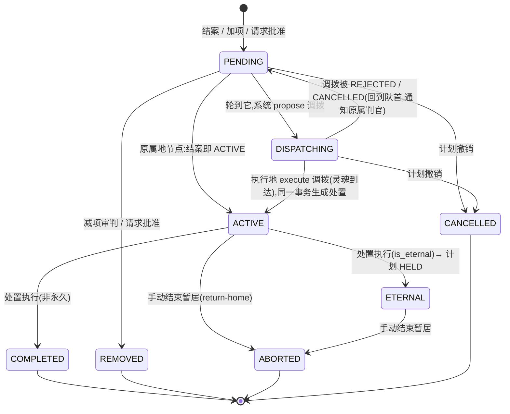

# 受刑计划(处置流程节点)—— 设计稿

> **状态:设计稿,尚未实施。** 2026-09-18 整理。基于 `main` = `0ac91b99`。
> 「现状」每一条都写了代码出处(文件:行);没有实跑过的推断标「未核实」。
> 第 10 节的问题拍板之前,本文不应被当作已定方案执行。

## 0. 用户的原话(权威需求)

> 正常来说应该是没有这种的,假设这个灵魂属于 A,被判需要 ABC 三地执行(BC 的执行顺序审判时候确定,假设是 BC 的顺序),那优先执行原属地,然后 B,完成后回到 A,检查还有嘛,有 C,那就去 C,完成后回 A,再次检测没有,那就允许转世申请。
>
> 未结案审判,只有可能 3 种情况,先分成两个大类,该灵魂在不该审判地点:1,在的话,那就加项或减项审判;2.1,若不在,会分两个情况,已经在当前地区执行完毕回到原属地(结案或者到下一个地区去受刑了),那就像该案判官追加请求,根据情况,增加受刑节点,或者再开一次审判;2.2,若不在当前区域,且还没到本区域执行,那就通过递交给判官申请,申请加项或减项审判。
>
> 话说受刑其实也应该有流程节点的吧,会好设计一点?

一句话:**审判结论生成一份有序的受刑计划;原属地节点先执行;每执行完一个节点回原属地,系统检查剩余节点,有则调往下一个,无则开放转生申请。现有「调拨 = 暂居」变成计划里的一个节点;三种未结案情况变成对计划的三种操作。**

---

## 1. 现状(代码实测,分库约束下的起点)

### 1.1 已经有的、要保留的

| 事实 | 出处 |
|---|---|
| 调拨是暂居:`Soul.tenant` 是此刻管辖,`Soul.home_tenant` 是原属;`tenant != home_tenant` 即暂居 | `apps/souls/models.py:272-288`、`:396-399`(`is_residing`) |
| 调拨状态机 `PROPOSED → APPROVED → EXECUTED → RETURNED`,另有 REJECTED / CANCELLED;每个灵魂同一时刻至多一条 PROPOSED/APPROVED(部分唯一约束) | `apps/dispatch/models.py:13-21`、`:90-96`、`:109-116` |
| 执行调拨 = 灵魂行锁下切 `tenant`,写 `SoulEvent(STATE_CHANGED, action=DISPATCH_EXECUTED)` | `apps/dispatch/services.py:231-281` |
| 暂居结束 `end_residence`:灵魂行锁 → 问 `open_judgments` → 有未结案则抛 `ResidenceReturnBlockedError` 什么都不写 → 否则 `tenant` 回 `home_tenant`、调拨记录 → RETURNED、写事件与审计 | `apps/dispatch/services.py:304-369`;异常定义 `:17-31` |
| 暂居中的灵魂**不能再被调拨**(保守默认,注释写明「待用户确认」) | `apps/dispatch/services.py:59-66` |
| 暂居租户的处置执行完毕 → 自动回归;永久刑期(`is_eternal`)不回归;被未结案审判拦下则记 `DISPATCH_RETURN_BLOCKED` 事件、每次暂居只通知一次 | `apps/disposition/services.py:755-802`;`apps/dispatch/services.py:371-411` |
| 撤案后补回归的启发式:「本次暂居开始以来暂居租户有一份**已执行、非永久**的处置,且没有未执行的处置」 | `apps/dispatch/services.py:448-483`;由 `Judgment.delete_or_raise` 调用 `apps/judgment/models.py:142-156` |
| 手动结束暂居 `return-home/`:只有原属租户或 ADMIN;理由必填;被未结案审判拦下答 409 + `code=open_judgment` + id 列表 | `apps/dispatch/views.py:341-380`;`apps/dispatch/serializers.py:180-182` |
| 「回归被拦下」通知收件人 = 原属与暂居两个租户里持有 `dispatch.read` 的在职官员(JUDGE 不持有,不收) | `apps/dispatch/services.py:413-446` |
| 暂居只读例外:原属租户对暂居灵魂及暂居地写在它身上的审判/处置/事件**只读**可见;纳入清单钉在契约测试里 | `apps/core/tenant.py:122-195`;`tests/test_tenant_scoping_contract.py:117-156` |
| 暂居中不进轮回也不进终局;转生资格/申请/申诉一律按原属文明 | `apps/souls/models.py:565-573`、`:575-588`;`apps/soul_accounts/rebirth.py:19-21` |
| `Judgment` 没有状态列;「未结案」= `verdict IS NULL AND is_final=False AND is_deleted=False`;一个灵魂同时只能有一个未结案审判(序列化器) | `apps/judgment/models.py:28-42`;`apps/judgment/serializers.py:130-150` |
| 审判结案是一个 saga:引条文 → 写裁决 → `DispositionService.create_from_judgment` → 可选建工作流 → 灵魂 `JUDGING → DISPOSED` → 事件;**灵魂进不了 DISPOSED 则整体回滚** | `apps/judgment/services.py:153-217` |
| 处置按**管辖文明**(`soul.civilization`,即当时的 `tenant`)路由到 realm;`is_eternal` / `memory_reset` 抄自 realm | `apps/disposition/services.py:120-167`、`:170-237` |
| 处置执行(原属):灵魂 `DISPOSED → REINCARNATING`(有来世)或 `→ SETTLED`(终局),按**原属文明** | `apps/disposition/services.py:667-753` |
| 灵魂推送:调拨批准 / 暂居开始 / 回归三种 kind,由 `SoulEvent.post_save` 信号接(不经总线);文案权威在 `packages/core/messages/*.json`,后端副本由测试逐字钉住 | `apps/soul_push/services.py:80-118`;`apps/soul_push/signals.py`;`apps/soul_push/messages.py:1-23` |
| 官员通知的多语言文案同一套办法;目前只有 `dispatch_return_blocked` 一种 | `apps/notifications/messages.py:11-36` |
| App 显示「暂居 X · 原属 Y」;皮肤跟当前文明,词表跟原属 | `mobile/src/rules.ts:181-188`;`mobile/src/screens/life.tsx:278-283`;`/me` 给出 `home_tenant`、`is_residing`:`apps/soul_accounts/serializers.py:69-72` |
| 审批工作流:`ApprovalWorkflow.tenant` 单租户;节点审批人按 ACTOR / ROLE / SYSTEM,`can_approve` 失败即拒;有条件路由 `on_pass` / `on_fail`;终态只有 COMPLETED / REJECTED | `apps/workflow/models.py:148-153`、`:665-740`、`:609-624`、`:31-34` |
| 行锁写法:`select_for_update(of=("self",))`;pytest 插件在 SQLite 上也拦「锁语句连带关联表却没写 `of=`」 | `apps/core/lock_join_guard.py:1-25` |
| PG 专属并发测试 7 条 `skipif(SQLITE)`,集合被 `test_the_postgres_only_set_is_the_set_we_think_it_is` 钉住 | `tests/test_concurrency.py:109-639`、`:851` |

### 1.2 现有机制里与本需求冲突或缺失的(设计要解决的点)

| # | 事实 | 出处 | 影响 |
|---|---|---|---|
| G1 | **暂居租户经真实 API 结不了案。** `conclude` 要求灵魂 `JUDGING → DISPOSED`,而 `DISPOSED` 的合法去向只有 REINCARNATING / SETTLED / LOST;暂居灵魂到达时已是 DISPOSED,暂居地新开的审判 `conclude/` 会得到 400 `JudgmentNotConcludableError`。**暂居测试全部绕开 `conclude/`**:直接 `Disposition.objects.create(...)`(`test_dispatch_residence.py:64-65`)和 `Judgment.all_objects.update(verdict=..., is_final=True)`(`:306-307`)。 | `apps/judgment/services.py:205-211`;`apps/souls/models.py:487-489` | 「加项 / 减项审判」是在 DISPOSED 灵魂身上结案的审判,现状不可达。未实跑 API,按代码路径推断(**未核实**)。 |
| G2 | 「B 的处置」今天没有生成路径:`create_from_judgment` 只从结案审判生成,而 G1 说暂居地结不了案。 | `apps/disposition/services.py:120` | 节点到达时必须有一条生成处置的新路径。 |
| G3 | `Disposition.judgment` 是 `OneToOneField(null=True)`,`can_delete` 在 `judgment is None` 时为 **True**。 | `apps/disposition/models.py:49-54`、`:178-184` | 节点生成的处置(没有审判)会变成可删。 |
| G4 | 「回原属地后检查剩余」现状由启发式 `resume_return_after_case_closed` 近似(「有一份已执行非永久处置、无未执行处置」),不是显式状态。 | `apps/dispatch/services.py:448-483` | 计划落地后删掉这段启发式,用节点状态回答。 |
| G5 | 转生资格 `SOUL_STATES_THAT_MAY_APPLY = ("JUDGING", "DISPOSED")`:**审判未结、处置未执行、暂居中**都能提交申请;`test_a_chinese_soul_residing_in_egypt_may_still_apply_and_home_reviews_it` 钉住「暂居中仍可申请」。 | `apps/soul_accounts/rebirth.py:52`、`:62-83`;`tests/test_dispatch_residence.py:585` | 与「全部节点完成才允许转世申请」直接冲突;也与架构文档 2026-09-17「暂居期间 … 转生申请 … 按原文明计算」的字面含义有张力(那条说的是**按谁算**,没说**何时能申**)。见第 10 节 Q6。 |
| G6 | 撤案后补回归靠 `delete_or_raise` 里的钩子;结案后回归靠「conclude 总会在暂居租户新建一份未执行的处置」(注释原话)—— 而 G1 说那个 conclude 走不通。 | `apps/dispatch/services.py:452-456` | 这段注释描述的是一条不存在的路径。 |
| G7 | `end_residence` 在灵魂行锁下问 `open_judgments`,但**开新审判不锁灵魂行**(注释 `ponytail:`),并发时可能漏看刚建的审判。 | `apps/dispatch/services.py:326-328`;`apps/judgment/views.py:118-137` | 计划推进用同一把锁,要把这条漏洞一并补上。 |
| G8 | 工作流 `announce` 只通知 `approver_actor`,按 ROLE 指定的节点**没人被通知**。 | `apps/workflow/services.py:597-609` | 若追加请求走工作流,「通知判官」还得另写。 |
| G9 | `EventType` 声明了 `DISPATCH_*` 成员(`:36-40`)却没有任何一处写入它们:调拨全部事件都是 `STATE_CHANGED` + `payload.action`;也没有 SENTENCE_* / DISPATCH_RETURNED。 | `apps/events/models.py:12-40`;`apps/dispatch/services.py:101`、`:262`、`:354` | 新事件沿用 `STATE_CHANGED + action` 还是加 EventType 成员,见 Q9。 |
| G10 | 本地分支 `feat/notify-judges`(1 提交 `1a1d0d62`,2 文件 +25/−4,新增 1 条测试):给「回归被拦下」通知加上**暂居地**持有 `judgment.execute` 的判官;原属地与第三文明的判官不收。 | `git log main..feat/notify-judges` | 见第 4.3 节。 |

### 1.3 分库约束(2026-09-14 用户拍板,`docs/ARCHITECTURE-soul-app-and-domain-split.md:10-11`、`:29`)

新表 **UUID 主键、不加跨租户外键、跨文明动作走事件**。现有 `DispatchRecord.source_tenant / target_tenant` 都是跨租户外键(同文档 §4 列为分库代价),本设计**不再增加这类外键**:节点上的执行地用 `tenant_code` 字符串,节点引用的处置 / 调拨记录用裸 `UUIDField`。

---

## 2. 领域模型

### 2.1 实体

```mermaid
erDiagram
    Soul ||--o{ SentencePlan : "soul_id"
    SentencePlan ||--|{ SentenceNode : "plan"
    SentencePlan ||--o{ SentencePlanRequest : "plan"
    Judgment ||--o| SentencePlan : "origin_judgment_id (UUID)"
    Judgment ||--o{ SentenceNode : "added_by_judgment_id (UUID)"
    SentenceNode ||--o| Disposition : "disposition_id (UUID)"
    SentenceNode ||--o| DispatchRecord : "dispatch_record_id (UUID)"

    SentencePlan {
        uuid id PK
        fk soul "本库外键(灵魂与计划同在原属库)"
        fk tenant "= soul.home_tenant;TenantManager 隔离用"
        int cycle "第几世,与 Judgment.cycle 同义"
        str status "ACTIVE|HELD|COMPLETED|CANCELLED"
        uuid origin_judgment_id "生成它的那份结案审判"
        bool reopen_requested "回原属地后先开一次审判(2.1 的「再开一次审判」)"
        datetime completed_at
        int version "乐观锁,AuditUserFields 已带"
    }
    SentenceNode {
        uuid id PK
        fk plan
        int order "1 起;原属地节点恒为 1"
        str tenant_code "执行地;CharField 不是外键(1.3)"
        bool is_home "= tenant_code == plan.tenant.code,冗余列便于约束"
        str status "见 3.2"
        uuid disposition_id "执行地写的处置;裸 UUID"
        uuid dispatch_record_id "把灵魂送到执行地的调拨记录;原属地节点为空"
        uuid added_by_judgment_id "首份审判或加项审判"
        uuid removed_by_judgment_id "减项审判 / 已批准请求(填请求 id)"
        bool is_eternal "处置执行时抄自处置"
        str reason "判官给的理由(官员可见,灵魂不可见)"
        datetime activated_at
        datetime completed_at
    }
    SentencePlanRequest {
        uuid id PK
        fk plan
        str from_tenant_code "提出请求的文明"
        str kind "ADD_NODES|REMOVE_NODES|REOPEN"
        json changes "kind 的参数:要加的 tenant_code 序列 / 要删的 node_id"
        str status "PENDING|ACCEPTED|REJECTED|WITHDRAWN"
        str reason "请求理由"
        str decision_reason "原审判官的理由"
        uuid requested_by_judgment_id "提出方本地的审判(可空)"
        datetime decided_at
    }
```

**为什么是三张表而不是把节点塞进 `DispatchRecord`:** 原属地节点没有调拨记录;一个节点可以在调拨之前就存在(PENDING)、也可以在没有调拨的情况下被减项;`DispatchRecord` 的部分唯一约束「一个灵魂至多一条 PROPOSED/APPROVED」是对**移动**的约束,不是对**计划**的约束。两者是不同的东西,硬合会让 `unique_active_dispatch` 开始撒谎。

**为什么 `SentencePlan.tenant = home_tenant`:** 计划属于原属文明(用户:「优先执行原属地」「回到 A 检查」),与转生申请、灵魂账号同一归属规则(`rebirth.py:19-21`、`test_tenant_scoping_contract.py:153-155`)。执行地对计划的可见性走**新的「节点方可读」例外**(见 2.4),不是把行写到执行地去。

### 2.2 约束(数据库层,PostgreSQL 执行;SQLite 不执行 varchar 长度,见 CLAUDE.md)

| 约束 | 形状 | 守什么 |
|---|---|---|
| 一个灵魂同一时刻至多一份**进行中**计划 | `UniqueConstraint(fields=["soul"], condition=Q(status__in=["ACTIVE","HELD"]))` | 两次结案并发不会生成两份计划(与 `unique_active_dispatch` 同形,`dispatch/models.py:90-96`) |
| 一份计划里节点序号唯一(活着的) | `UniqueConstraint(fields=["plan","order"], condition=Q(status__notin=["REMOVED","CANCELLED"]))` | 并发加项撞同一序号时 IntegrityError → 409,不是两条同序节点 |
| 一份计划同一时刻至多一个「在路上或受刑中」的节点 | `UniqueConstraint(fields=["plan"], condition=Q(status__in=["DISPATCHING","ACTIVE"]))` | 推进的幂等(第 8 节) |
| 原属地节点有且只有一个,`order=1` | `UniqueConstraint(fields=["plan"], condition=Q(is_home=True))` + `CheckConstraint(~Q(is_home=True) \| Q(order=1))` | 「优先执行原属地」是约束不是约定 |
| `order >= 1` | `CheckConstraint` | 同上 |
| 一份计划同一时刻至多一条 PENDING 请求 | `UniqueConstraint(fields=["plan"], condition=Q(status="PENDING"))` | 原审判官的收件箱一次只处理一条;第二条请求方会得到 409,而不是两条互相矛盾的请求同时待决 |

### 2.3 与既有实体的关系

| 既有实体 | 变化 |
|---|---|
| `Judgment` | 加两列:`kind = ORIGINAL \| AMENDMENT`(默认 ORIGINAL;存量全 ORIGINAL)、`amends_plan_id = UUIDField(null=True)`。**AMENDMENT 结案不建处置、不动灵魂状态**,只改计划;这解开 G1。`open_judgments` 定义不变。 |
| `Disposition` | 加一列 `sentence_node_id = UUIDField(null=True, db_index=True)`;`can_delete` 改为 `judgment is None and sentence_node_id is None`(解开 G3)。`tenant` 仍是执行地。路由不变:`_route_to_realm(soul, verdict, method)` 用当时的 `soul.civilization`(= 节点执行地),verdict 取**原审判**的裁决,方法取执行地的默认方法(`Soul.die` 的 `method_map`,`souls/models.py:729-734`)。 |
| `DispatchRecord` | 不加列。计划推进时由系统 `propose`,`dispatched_by=None`、`reason` 写「受刑计划 <id> 节点 <order>」;`propose` 的「暂居中不能再调拨」保留(灵魂每次都先回原属地)。 |
| `Soul` | 不加列、不加状态(理由见 3.3)。 |
| `SoulAccount / RebirthApplication` | 不加列;`eligibility` 加一条(第 6 节)。 |

### 2.4 可见性与权限

- `SentencePlan` / `SentenceNode` / `SentencePlanRequest` 的读:原属租户按 `tenant` 正常隔离;**执行地租户可读自己有节点的计划**(新例外,形状同 `DispatchRecordViewSet.get_queryset` 的「源或目标」,`dispatch/views.py:128-140`)。新视图必须进 `test_tenant_scoping_contract.py` 的两张分类表之一(`:139-141` 的 `test_every_soul_linked_viewset_is_classified`)。
- 写:
  - 生成计划 / 加减项:随 `judgment.execute`(ADMIN / JUDGE / MODERATOR,`apps/perm/models.py:286-288`、`:408-419`、`:452-467`)—— 它们就是审判的一部分,不另设 codename。
  - 追加请求:提出 = `judgment.execute`(提出方租户);决定 = `judgment.execute`(原属租户)+ **必须是原审判的判官所在租户**(对象级检查,同 `_initiator_or_403` 形状,`dispatch/views.py:521-537`)。
  - 撤销计划(整份):新 codename `sentence_plan.cancel`,只给 ADMIN / MODERATOR —— 与 `dispatch.return` 同一持有者(`perm/models.py:316`);这是一次越过审判结论的决定,理由必填、写审计。
- ADMIN 的租户豁免照旧(`apps/core/tenant.py:41-49`)。

---

## 3. 状态机

### 3.1 计划



- **COMPLETED 是推进函数算出来的**,不是谁点出来的:每次「灵魂回到原属地」或「节点状态变化」都调 `SentencePlanService.advance(soul)`,它在锁下重算(第 8 节)。
- **HELD** 对应今天「永久刑期不自动回归」(`disposition/services.py:772-773`)。灵魂留在执行地,计划挂起;后面的 PENDING 节点不动。手动结束(现有 `return-home/`)把该节点标 ABORTED、回归、计划回 ACTIVE 继续推进。
- **CANCELLED** 是纠错口(等价于今天 ADMIN 的 `correct_settlement` 那类操作,`souls/models.py:653-689`):未执行节点全部 → CANCELLED,进行中的调拨记录 → CANCELLED(走现有 `DispatchService.cancel`),灵魂若在外则**不自动回归**(那是另一次 `return-home`,各留各的审计)。

### 3.2 节点



**只有 PENDING 能被减项。** ACTIVE / DISPATCHING / COMPLETED / ETERNAL 一律不能撤销 —— 已经开始的刑不能靠改计划抹掉,要终止它是 ABORTED(带理由、带审计),要否认它是撤销整份计划(更重的口子)。已 COMPLETED 的节点连 ABORTED 都不行:它是历史。

### 3.3 推进规则(`SentencePlanService.advance(soul)`,伪代码)

```
锁 Soul 行(select_for_update(of=("self",))),再锁 Plan 行
if plan.status not in (ACTIVE,): return
if soul.is_residing: return                        # 还没回来,什么都不做
if open_judgments(soul).exists(): return           # 未结案审判先处理(情况 1 / 再开审判)
if plan.reopen_requested:
    plan.reopen_requested = False
    Judgment.objects.create(soul, tenant=home, kind=AMENDMENT, amends_plan_id=plan.id)  # 与 die() 建案同形
    return                                         # 结案时会再调 advance
if 有 PENDING 请求: return                           # 原审判官先决定
next = 首个 PENDING 节点(按 order)
if next is None:
    if 存在 DISPATCHING/ACTIVE 节点: return         # 不该发生;约束挡住
    plan.status = COMPLETED; plan.completed_at = now
    灵魂状态: home_civilization in REBIRTH_CAPABLE → DISPOSED→REINCARNATING;否则 → SETTLED
        (即今天 DispositionService.execute 原属分支做的事,disposition/services.py:736-748)
    事件 + 推送 sentence_completed
    return
if next.is_home:                                   # 只在再开审判加了原属地节点时出现
    生成原属处置(tenant=home, sentence_node_id=next.id);next → ACTIVE;return
DispatchService.propose(home, Tenant(next.tenant_code), soul, dispatcher=None, reason=...)
next.status = DISPATCHING; next.dispatch_record_id = record.id
通知执行地判官(第 5 节)
```

调用点(全部在既有事务内、灵魂行锁之下):

| 触发 | 现有代码位置 | 改动 |
|---|---|---|
| 原审判结案 | `JudgmentConclusionService.conclude_judgment` 第 2 步之后 | 建计划 + 原属节点(ACTIVE,disposition_id = 刚建的处置) |
| 原属处置执行 | `DispositionService.execute` 原属分支 `disposition/services.py:732-753` | **不再直接推 REINCARNATING/SETTLED**;标节点 COMPLETED → `advance` 决定是调走还是完成 |
| 执行地处置执行 | `_execute_during_residence` `:781-802` | 标节点 COMPLETED/ETERNAL;非永久 → `end_residence`(现状)→ 回归后 `advance` |
| 回归(自动或手动) | `end_residence` 末尾 | 手动的把节点标 ABORTED;两者都调 `advance` |
| 撤案 / 加项减项审判结案 | `Judgment.delete_or_raise`(替换 `resume_return_after_case_closed`)、AMENDMENT 结案 | 调 `advance` |
| 调拨被拒 / 取消 | `DispatchService.reject` / `cancel` | 节点 → PENDING,通知原属判官;不自动重试(Q4) |
| 请求被决定 | `SentencePlanRequestService.decide` | 调 `advance` |

**灵魂 `current_state` 不加新值。** 整个计划期间灵魂保持 DISPOSED(今天暂居也是这样,`_execute_during_residence` 明确「不推进灵魂的生命周期状态」,`disposition/services.py:757-761`);计划完成那一刻做今天原属处置执行做的那次转移。不加新 `SoulState` 的理由与 `UNKNOWN_CIVILIZATION` 那段注释相同(`souls/models.py:97-110`):`SoulState.choices` 是多处模型字段的 `choices=`,App 的六枚徽章逐个枚举(`mobile/src/rules.ts:36-61`),加一个成员是跨五个包的改动,而「在哪个节点」这个信息由计划回答更准。

**`ReincarnationService.execute` 的原属守卫**(`reincarnation/services.py:66-68`)保留:节点处置执行不再触发轮回,轮回只在计划 COMPLETED 时由 `advance` 触发(把 `disposition/views.py:132-152` 里那次 `ReincarnationService.execute(disposition)` 挪到 `advance` 的完成分支)。

---

## 4. 三种未结案情况 → 计划操作

判定用的量:X = 开审判的租户;`soul.tenant`;X 在计划里的节点 `node_X`(可能不存在、可能多个,取最后一个)。

| 情况 | 判定 | 操作 | 谁发起 | 谁批准 | 改哪些节点 |
|---|---|---|---|---|---|
| **1. 灵魂就在 X** | `soul.tenant.code == X` | X 的判官开一份 **AMENDMENT 审判**(`kind=AMENDMENT, amends_plan_id`),结案时带 `plan_changes = {add: [...tenant_code], remove: [...node_id]}` | X 的判官(`judgment.create`) | 结案本身就是批准(`judgment.execute`);**不走审批工作流** | `add`:在**当前节点之后**插入,序号顺延;`remove`:只允许 PENDING。X 加自己 = 在后面再插一个 X 节点(灵魂回 A 再来一次),不是原地延长 |
| **2.1 灵魂已在 X 执行完毕、走了** | `node_X.status in (COMPLETED, ABORTED)` 且 `soul.tenant.code != X` | X 的判官提交 **`SentencePlanRequest`**,`kind = ADD_NODES` 或 `REOPEN` | X 的判官 | **原审判官所在租户(原属)** 的判官 ACCEPT / REJECT | ACCEPT+ADD_NODES:追加 PENDING 节点到队尾;ACCEPT+REOPEN:`plan.reopen_requested=True`,灵魂下次回原属地时 `advance` 自动建一份原属 AMENDMENT 审判(灵魂在外时原属不能开审判:`test_the_home_tenant_cannot_write_to_the_residing_soul`) |
| **2.2 灵魂还没到 X** | `node_X.status in (PENDING, DISPATCHING)` 或 X 不在计划里 | X 的判官提交 `SentencePlanRequest`,`kind = ADD_NODES` / `REMOVE_NODES` | X 的判官 | 原属判官 | ACCEPT:改 PENDING 节点(加 / 删);DISPATCHING 的 X 节点不能删(调拨已提议,先在调拨侧 reject 它,节点自动回 PENDING 后再删) |

**边界:**

- 情况 1 的审判未结时,灵魂**不能离开 X**:`end_residence` 已经这样做(`ResidenceReturnBlockedError`),`advance` 第三行同样先看 `open_judgments`。`DISPATCH_RETURN_BLOCKED` 事件与「每次暂居只通知一次」保留原样。
- 情况 1 的审判被**撤案**(`delete_or_raise`):计划不变,`advance`。
- 减项时目标节点已经 ACTIVE:序列化器 400,错误里给出该节点状态;不静默跳过。
- 一份计划同一时刻至多一条 PENDING 请求(2.2 约束);第二个文明要等第一条决定。
- 请求方可以 WITHDRAWN 自己 PENDING 的请求。
- 灵魂在 X、X 却走 2.x 提请求:序列化器拒绝,提示「灵魂在本地,直接开审判」;反之灵魂不在 X 却开 AMENDMENT 审判:`validate_soul` 的 `same_tenant_or_404_message` 已经会 404。
- **审计与事件:**每次节点集合变化写一条 `SoulEvent(STATE_CHANGED, action=SENTENCE_PLAN_AMENDED, payload={plan_id, added:[...], removed:[...], by_judgment_id | by_request_id})` 到**原属租户**,加一条 `AuditLog(resource="sentence_plan")`;请求的创建与决定各一条 `action=SENTENCE_REQUEST_*` 写到**提出方**租户(原属经节点方例外读得到)。

**为什么追加请求不用审批工作流(评估结论):**

| 维度 | 复用 `ApprovalWorkflow` | 自建 `SentencePlanRequest`(推荐) |
|---|---|---|
| 租户 | 工作流单租户(`workflow/models.py:148-153`),`ApprovalWorkflowViewSet` 明确**不纳入**暂居只读例外(`test_tenant_scoping_contract.py:146-149`);请求是两租户的事 | 与 `DispatchRecord` 同形:`from_tenant_code` + `plan.tenant`,两方各自可读 |
| 审批人 | 按 ROLE 指定的节点 `announce` 不通知任何人(G8);`can_approve` 只比 `user.role == approver_role`,不看租户 —— 任何租户的 JUDGE 都能批 | 对象级检查「原属租户 + judgment.execute」一处写完 |
| 状态 | 7 个状态里 3 个不可达(`workflow/models.py:23-34`),投影逻辑要像 `rebirth.py:193-207` 再写一遍 | 4 个状态,PENDING → ACCEPTED/REJECTED/WITHDRAWN |
| 收益 | 条件路由、多级审批 —— 请求只有一级 | — |
| 代价 | 一张表 + 一个小状态机(约 80 行模型 + 服务) | 同 |

转生申请走工作流是因为它**确实**是多级(判官初审 → 终审,`rebirth.py:44-51`);追加请求是原审判官一个人的决定。

---

## 5. 通知与推送

### 5.1 官员站内通知(`EventService.notify_user`,`events/services.py:160-190`;文案键进 `apps/notifications/messages.py` 与 `packages/core/messages/*.json` 的 `official_notify`,两边一致由现有测试钉住)

| 时机 | 收件人(均限在职 `is_active`) | 文案键 |
|---|---|---|
| 节点 DISPATCHING(系统提议调拨) | 执行地**全部在职用户**(现有 `_notify_target_tenant` 就是这样发的,`dispatch/services.py:132`,不变)—— 判官已在其中,不另发 | 现有 `DISPATCH_PROPOSED` |
| 节点 ACTIVE(灵魂到达、处置已生成) | 执行地判官 | `sentence_node_active` |
| 节点 COMPLETED / ETERNAL / ABORTED | 原属判官 | `sentence_node_done` |
| 回归被拦(现有 `DISPATCH_RETURN_BLOCKED`) | 现有规则(两地 `dispatch.read`)**加暂居地判官** —— 即 `feat/notify-judges` 的规则 | 现有 `dispatch_return_blocked` |
| 调拨被拒 / 取消,节点回 PENDING | 原属判官 | `sentence_node_refused` |
| 计划被加项 / 减项(AMENDMENT 结案或请求 ACCEPT) | **每个被加或被删节点所在文明**的判官 + 原属判官 | `sentence_plan_amended` |
| 请求创建 | 原属判官 | `sentence_request_pending` |
| 请求决定 | 提出方判官 | `sentence_request_decided` |
| 计划 COMPLETED | 原属判官 | `sentence_plan_completed` |

「判官」= 持有 `judgment.execute` 的用户 = ADMIN / JUDGE / MODERATOR(`perm/models.py`);ADMIN 只算**该租户**的 ADMIN(同 `return_blocked_recipients` 的写法,`dispatch/services.py:427-430`)。文案只带灵魂名、文明名、节点序号,**不带**审判 id、裁决、理由。

### 5.2 灵魂推送(`apps/soul_push/services.py` 映射表)

| 现有 kind | 处理 |
|---|---|
| `residence_approved` / `residence_started` / `residence_returned` | **保留原样**。它们挂在 `DispatchRecord` 的 APPROVED / EXECUTED / RETURNED 上,而计划仍用调拨记录搬运灵魂;文案「即将暂居」「暂居开始」「暂居结束」对节点仍然成立 |
| `disposition_executed` | 保留;但**触发条件要改**:它现在挂在灵魂进入 REINCARNATING/SETTLED(`:82-84`),而计划期间处置执行不再改灵魂状态。改挂到 `action=SENTENCE_NODE_COMPLETED` 事件,dedupe_key 用节点 id |
| 新增 `sentence_completed` | 「受刑完毕,可以申请转生」—— 这是用户最在意的那一刻;`data.screen="Life"` |
| 新增 `sentence_amended` | 「你的受刑计划有变更,打开灵魂簿查看」;不说加了哪里、为什么 |

不推:请求创建 / 决定(官员之间的事)、节点 DISPATCHING(批准时已有 `residence_approved`)。

---

## 6. 转生申请的开放条件

现状(G5):`eligibility` 只看 `current_state in (JUDGING, DISPOSED)`、无进行中申请、本世未获批、冷却(`rebirth.py:62-83`)。

改为:在 `soul_state` 之后加一条

```
plan = SentencePlan.objects.filter(soul=soul, cycle=account.cycle).order_by("-created_at").first()
if plan is None or plan.status != COMPLETED: return False, "sentence_in_progress", None
```

并把 `SOUL_STATES_THAT_MAY_APPLY` 收成 `("DISPOSED", "REINCARNATING")`(REINCARNATING 是计划完成后原属分支写下的状态;DISPOSED 只在终局文明或计划回填异常时出现)。

与既有规则的关系:

- **冷却**(`cooldown_days`、`FINAL_REJECTIONS`)不变。
- **申诉**不变:`can_appeal` 不看计划(`rebirth.py:228-233`);调拨前 / 计划完成前被驳回的申请仍可申诉一次。
- **按原属文明**不变:计划本来就在原属。
- `terminal_cosmology` 的判定不变,且在计划之前:埃及 / 欧洲本土灵魂计划 COMPLETED 时进 SETTLED,永远到不了申请。
- 拒绝码 `sentence_in_progress` 加进 `REFUSALS`、`packages/core` 语言包与 App 的资格提示。

**存量**:回填(第 7.2 节)给每个当前世有已结案审判的灵魂建一份计划,所以「没有计划」只剩下 ALIVE / JUDGING 的灵魂,它们本来就不该申请。**这改变了「JUDGING 可申请」的现状** —— 见 Q6。

---

## 7. 与现有暂居机制的迁移

### 7.1 代码

| 现有 | 处置 |
|---|---|
| `DispatchRecord` 模型、状态机、`propose/approve/reject/execute/cancel`、`_notify_target_tenant`、`_notify_approval` | **保留**,是节点的搬运层。`propose` 增加 `dispatched_by=None` 的系统调用;视图 `create` 对有 ACTIVE 计划的灵魂拒绝手动提议(Q3) |
| `end_residence` | 保留;末尾加 `advance`;手动触发时标节点 ABORTED |
| `record_blocked_return` / `_notify_return_blocked` / `return_blocked_recipients` | 保留;收件人并入 5.1 的规则 |
| `resume_return_after_case_closed` | **删除**(G4/G6),`delete_or_raise` 改调 `advance` |
| `DispositionService.execute` 原属分支 | 改:节点 COMPLETED → `advance`,不直接转移灵魂状态 |
| `_execute_during_residence` | 改:标节点;其余保留 |
| `disposition/views.py:132-152` 的 `ReincarnationService.execute` 调用 | 挪到 `advance` 完成分支 |
| `return-home/` 端点、`DispatchReturnSerializer` | 保留 |
| 暂居只读例外(`apps/core/tenant.py`)与 `RESIDENCE_READABLE` 表 | 保留;新增三张分类 |
| `test_dispatch_residence.py`(42 条)、`test_dispatch_return_blocked_notice.py`(7 条)、`test_soul_push_residence_approved.py`(6 条) | 前者约三分之一要重写(直接建处置的夹具换成「节点激活生成处置」;`:585` 那条按 Q6 的结论改或删);后两者不变 |
| `frontend/src/__tests__/dispatchReturnHome.test.tsx`、`mobile/src/__tests__/residence.test.tsx` | 不变(端点与 `/me` 字段不变) |

### 7.2 存量数据回填(115 上是测试数据;迁移可接受,但要幂等)

管理命令 `manage.py backfill_sentence_plans`(与 `seed_mythology` 同一「幂等种子」惯例),不放进 schema 迁移的数据步骤(CLAUDE.md:PG 上失败语句中止整个事务的教训):

1. 每个灵魂、每个 `cycle`,若存在 `verdict IS NOT NULL` 的 ORIGINAL 审判且没有计划 → 建 `SentencePlan(origin_judgment_id=最早那份, cycle)`。
2. 原属节点:`order=1, tenant_code=home_tenant.code, disposition_id=` 该审判的处置;状态按处置:`is_executed and is_eternal → ETERNAL`;`is_executed → COMPLETED`;否则 ACTIVE。
3. 每条 EXECUTED / RETURNED 的 `DispatchRecord`(按 `executed_at`)追加一个执行地节点:`dispatch_record_id`;在该租户找 `Disposition(soul, tenant, created_at >= executed_at)` 的第一条作 `disposition_id`;状态:RETURNED → COMPLETED(或 ABORTED,若事件 `trigger=MANUAL`);EXECUTED 且处置已执行且 `is_eternal` → ETERNAL;EXECUTED 且处置已执行 → COMPLETED(回归被拦中);EXECUTED 未执行 → ACTIVE。
4. 计划状态:有 ETERNAL 节点且灵魂在外 → HELD;灵魂 `current_state in (REINCARNATING, SETTLED, ALIVE)`(已完成过)→ COMPLETED,`completed_at` 取状态变化事件时间;否则 ACTIVE。
5. 回填后**跑一次 `advance`**?**不跑。** 回填只描述已发生的事,不推进;推进由下一次业务动作触发。命令打印每类计数,重复运行第二次的计数必须全为 0(幂等断言写进命令的测试)。

迁移 0036 的选择(`souls/migrations/0036_soul_home_tenant.py` 文档字符串)沿用:曾被单程调拨过的存量灵魂已被回填成目标文明本土,这里不重算原属。

### 7.3 `feat/notify-judges`

不合并。它改的 `return_blocked_recipients` 在 5.1 里被更宽的规则(节点所在文明的判官)覆盖;它的测试 `test_the_residence_judge_is_told_but_no_other_judge` 三个反例(原属判官、第三文明判官、已离职判官)**原样搬进**阶段 2 的收件人测试。阶段 2 合并后删分支。代价:在阶段 2 落地之前,`main` 上「回归被拦下」通知仍不到判官(现状)。若用户要先补这一条,它 1 提交 25 行可以独立合并,阶段 2 再改一次(Q8)。

---

## 8. 并发与一致性

**锁序(全库统一,新代码遵守):`Soul` → `SentencePlan` → `SentenceNode` → `DispatchRecord` / `Disposition`。** 现有代码已经把灵魂行锁当作调拨 / 处置 / 状态机的总锁(`end_residence :323`、`_execute_during_residence :782`、`transition_to :533`、`dispatch execute :249`),计划挂在同一把锁之下,不引入第二把总锁。

- 所有锁语句写 `select_for_update(of=("self",))`,关联对象在锁外另取(`apps/core/lock_join_guard.py` 在 SQLite 上也会拦)。
- **幂等:**`advance` 是状态的纯函数 —— 第二次调用看到节点已是 DISPATCHING/ACTIVE 就退出;两次并发调用被灵魂行锁串行化;即使串行化失效,`unique_active_dispatch` 与「一个计划至多一个 DISPATCHING/ACTIVE 节点」两条部分唯一约束把第二条写入变成 IntegrityError(视图翻成 4xx,同 `dispatch/views.py:199-203` 把 `unique_active_dispatch` 的 IntegrityError 翻成 400)。
- **G7 补上:**`JudgmentViewSet.perform_create` 在建案前锁灵魂行(与 `advance` 同一把锁),让「开审判」与「回归 / 推进」串行。
- 计划 `version` 列(AuditUserFields 已带)用于官员端编辑的乐观并发:序列化器要求 `version`,不匹配 409。
- 事件与通知**在事务提交后**发(`transaction.on_commit`),沿用 `SoulPushHandler.handle` 的做法(`soul_push/handler.py:20-35`);计划推进的 `SoulEvent` 与 `AuditLog` 在事务内写(与 `end_residence` 同)。

**PostgreSQL 专属测试清单**(`skipif(SQLITE)`,加进 `test_the_postgres_only_set_is_the_set_we_think_it_is` 钉住的集合;每条都用 `tests/test_concurrency.py` 现有的屏障写法):

1. 两个官员并发执行原属处置 → 恰好一条 `DispatchRecord`、节点 DISPATCHING 一个、`{200, 400}`。
2. 执行地处置执行(回归)与原属开新审判并发 → 要么审判在回归前建好并拦下回归,要么回归先完成、审判建在原属;**不存在**「回归了、审判却挂在执行地」。
3. 两条并发加项(AMENDMENT 结案 × 请求 ACCEPT)同一序号 → 一条 409,节点序号无重复。
4. 计划完成与 `rebirth.submit` 并发 → 申请要么被 `sentence_in_progress` 拒绝、要么建在 COMPLETED 之后;不存在建在 ACTIVE 计划上的申请(账号行锁 + 计划状态在同一事务读)。
5. 两个执行地官员并发执行节点处置 → `{200, 400}`(现有 `disposition/views.py:96-116` 的模式),节点 COMPLETED 恰一次、回归恰一次。
6. 撤销计划与节点推进并发 → 撤销后不再出现新的 DISPATCHING。

SQLite 上跑不到这 6 条(CLAUDE.md「SQLITE HIDES A WHOLE CLASS OF DEFECT」);合并前按 CLAUDE.md 的 `--create-db` 命令在真 PG 上跑一遍,读退出码。

---

## 9. 分阶段实施

每阶段可独立合并;门禁 = CLAUDE.md 的后端四条 + 前端五条 + core 三条 + E2E 三个 project,**全部读退出码**,并在真 PG 上跑一次。

| 阶段 | 内容 | 验收 |
|---|---|---|
| **1 模型** | 三张表 + 迁移;`Judgment.kind / amends_plan_id`;`Disposition.sentence_node_id` + `can_delete`;回填命令;只读 API(`/api/v1/sentence-plans/`、`/requests/`)与两张分类表;**结案时建计划 + 原属节点,但推进逻辑不接入**(行为不变) | `makemigrations --check`;回填命令在 115 数据上跑两次,第二次计数全 0;`test_every_soul_linked_viewset_is_classified` 绿;OpenAPI `schema:generate` 两道门禁 0 warning / 0 error |
| **2 推进** | `conclude/` 接受 `sentence_nodes`;`advance` 与 3.3 表的全部调用点;删 `resume_return_after_case_closed`;`eligibility` 改;5.1 / 5.2 的事件、通知、推送;`feat/notify-judges` 的三个反例并入 | 重写 `test_dispatch_residence.py`;第 8 节 PG 测试 1、2、5;推送与通知文案的两份镜像测试;`test_soul_push_messages_match_the_language_packs` |
| **3 加减项** | AMENDMENT 审判结案(`plan_changes`);`SentencePlanRequest` 模型 / 端点 / 决定;`sentence_plan.cancel`;`perform_create` 锁灵魂行(G7) | PG 测试 3、4、6;每种拒绝(减 ACTIVE 节点、灵魂在本地却提请求、第二条 PENDING 请求)各一条 400/409 测试且**断言未写入** |
| **4 客户端** | Web:结案对话框的受刑地序列;灵魂详情的计划面板;请求收件箱;App:Life 屏「我的受刑」;新推送 kind 的落地页 | `tsc`、`lint --max-warnings 0`、`test:coverage` 阈值;E2E 三个 project;App 两种模拟器实测截图 |
| **5 收尾** | 删旧注释(`dispatch/services.py:452-456` 那段描述不存在路径的);架构文档决策记录补一条;`SOUL_STATES_THAT_MAY_APPLY` 收紧 | 全量门禁 |

阶段 1 合并后系统行为**逐字节不变**(计划只是记录),这是回滚点。

---

## 10. 待用户拍板

| # | 问题 | 选项 | 推荐与代价 |
|---|---|---|---|
| **Q1** | 执行地节点的**处置内容**由谁定 | (a) 原审判只定「去哪个文明」,灵魂到达时按执行地宇宙观 + 原审判裁决自动路由(`_route_to_realm`),执行地官员只执行;(b) 原审判官同时指定执行地的 realm / 刑期;(c) 执行地必须再开一份审判才产生处置 | **(a)**。(b) 要让中国判官选埃及 realm,`StatuteCitationService.resolve` 拒绝跨宇宙观引用(`judgment/services.py:55-60`)的立场与之相反;(c) 每个节点多一次审判,且撞 G1。(a) 零新路由代码 |
| **Q2** | 情况 1 的加项减项要不要**原审判官批准** | (a) X 的 AMENDMENT 结案即生效;(b) 也走 `SentencePlanRequest`,原属批准后生效 | **(a)**,用户原话「加项或减项审判」是审判本身。(b) 多一次往返;若想要「原属知情」,5.1 的 `sentence_plan_amended` 通知已覆盖 |
| **Q3** | 计划 ACTIVE 时**手动**提议调拨 | (a) 拒绝(400,提示走计划);(b) 自动追加为队尾节点;(c) 允许,与计划无关 | **(a)**。(b) 等于绕过审判加项;(c) 会让 `advance` 与手动调拨争同一条 `unique_active_dispatch`。没有计划的灵魂(ALIVE / JUDGING)照旧允许手动调拨 —— 那是现状,阶段 1 不改 |
| **Q4** | 系统提议的调拨被执行地 **REJECTED** | (a) 节点回 PENDING、通知原属判官,人来决定(减项或重试);(b) 自动重试 N 次;(c) 视为 ABORTED | **(a)**。拒绝是一次人的决定,机器重试会把它变成骚扰;(c) 抹掉了原审判的结论 |
| **Q5** | 永久刑期节点后面还有 PENDING 节点 | (a) 计划 HELD,后面的永远不执行,直到手动结束;(b) 结案时序列化器拒绝「永久之后还有节点」 | **(a)**。永久与否在**处置生成时**才知道(抄自 realm,`disposition/services.py:139`),结案时判断不了 |
| **Q6** | 转生申请何时开放 | (a) 只在计划 COMPLETED(用户原话);(b) 维持现状:JUDGING / DISPOSED / 暂居中都可申,审批时再看;(c) DISPOSED 且原属节点 COMPLETED 即可(不等外地节点) | **(a)**。要改 `SOUL_STATES_THAT_MAY_APPLY` 与 `test_dispatch_residence.py:585`、`:629`(后者「调拨前被驳回的申请暂居中可申诉」**不受影响**,申诉不看计划)。(b) 与原话冲突;(c) 会让灵魂在 B 受刑时申请转生 |
| **Q7** | REOPEN 请求批准后,原属的新审判**何时开** | (a) 灵魂下次回原属地时自动开(3.3);(b) 立刻开,即使灵魂在外 | **(a)**。(b) 撞 `same_tenant_or_404_message`,且一个灵魂同时只能有一个未结案审判 |
| **Q8** | `feat/notify-judges` | (a) 不合并,并入阶段 2;(b) 先合并,阶段 2 再改 | **(a)**,用户已表态倾向替代。(b) 的好处是 `main` 立刻多一类收件人;代价是同一处改两次 |
| **Q9** | 新事件的类型 | (a) 沿用 `STATE_CHANGED + payload.action`(与全部调拨事件一致,推送信号按 action 接);(b) 加 `EventType.SENTENCE_*` 成员 | **(a)**。(b) 要动 `EventType.choices` 的迁移,并让 `SoulPushHandler.should_handle` 多认几种;现有调拨事件全是 (a) 的写法 |
| **Q10** | 灵魂端对节点看到多少 | (a) 序列、文明名、状态、每个节点的处置(realm、刑期、执行时间);不显示理由、判官、请求;(b) 只显示当前节点与总数 | **(a)**,与已定可见字段一致(处置本来可见;`evidence_json` / 备注 / 审批人不可见)。节点 `reason` 与请求记录**只给官员** |
| **Q11** | 计划撤销(`sentence_plan.cancel`)要不要做进第一轮 | (a) 阶段 3 做;(b) 不做,靠 ADMIN 改数据 | **(a)**。没有它,`correct_settlement` 那类纠错在计划上无处落;做成带理由的审计操作比 shell 改表可追溯 |

---

## 附:各方案在原话场景上的走法(A 中国、B 埃及、C 欧洲)

```mermaid
sequenceDiagram
    participant A as A 原属(判官/官员)
    participant S as 系统(advance)
    participant B as B 执行地
    participant C as C 执行地
    participant App as 灵魂 App
    A->>S: conclude(verdict=FAILED, sentence_nodes=[B, C])
    S-->>S: 计划 ACTIVE;节点 1=A ACTIVE(处置已生成),2=B,3=C PENDING
    A->>S: 执行 A 的处置
    S-->>S: 节点 1 COMPLETED;advance → propose(A→B);节点 2 DISPATCHING
    S-->>B: 通知:待批准调拨 + 判官
    S-->>App: 推送 residence_approved(B 批准后)
    B->>S: approve;execute
    S-->>S: soul.tenant=B;节点 2 ACTIVE;按 B 宇宙观生成处置
    S-->>App: 推送 residence_started
    B->>S: 执行 B 的处置
    S-->>S: 节点 2 COMPLETED;end_residence;soul.tenant=A;advance → propose(A→C);节点 3 DISPATCHING
    S-->>App: 推送 residence_returned
    C->>S: approve;execute;执行 C 的处置
    S-->>S: 节点 3 COMPLETED;回归;advance → 无 PENDING → 计划 COMPLETED;soul → REINCARNATING
    S-->>App: 推送 sentence_completed
    App->>S: rebirth.submit → eligibility 通过
```
