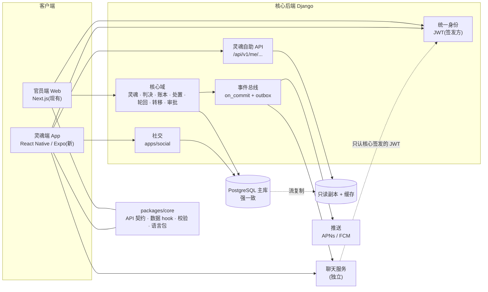

# 灵魂端与按业务域拆分 —— 架构设计

> **状态:设计稿,尚未实施。** 2026-09-13 与用户讨论后整理。
> 文中「现状」一节的每条事实都在 `main`(`e46eeb1`)上实测过;「目标」一节是设计,不是现状。
> 待决策的点集中在文末,在它们被拍板之前,本文不应被当作已定方案执行。

## 决策记录(2026-09-14 用户拍板)

- **灵魂登录:要做,排在后面。**
- **四个地区不受数据法规约束,但仍选第 3 档(按租户分库)。** 与第 7 节「第 3 档唯一触发条件是法规」的推荐不同 —— 这是用户知悉代价后的选择,以此为准。
  实施时第 4 节的代价逐条成为工程任务:跨租户转移/联审改 Saga + 补偿、去掉跨库外键、按租户路由查询、全局表(用户/角色/菜单/语料)归属、灵魂转移时账号与记录跨库迁移。
  **「按业务域拆」仍然成立**:聊天独立、灵魂读走副本,与按租户分库叠加。
- **灵魂身份:** 死亡同步接口登记后自动创建账号,或官员手动创建;创建成功后自动发送随机登录密码。**三道保护一并实施:**
  初始密码 72 小时有效;首次登录强制改密(`must_change_password`);只发一次,过期由官员重置而非重发原密码。
  **发送渠道:** 灵魂联系方式随死亡登记同步;缺失时进入「待交付」列表,由官员线下处理。
- **聊天:选 Matrix(自建)。** 理由是第 3 档:Matrix 联邦制与按租户分库同形 —— 每个文明一个 homeserver,数据留在本地库,
  跨文明聊天靠联邦互通;身份接核心后端签发的认证;React Native 端 SDK 的成熟度在选型实施时实测。
- **转生申请与灵魂可见字段:** 草图(Artifact「转生申请与灵魂可见字段」)用户确认无问题,六项采用建议:
  1. 初始密码发送渠道:同上
  2. 公开审理殿与主审判官;**不公开**各审批节点的具体审批人(只显示角色)
  3. 功过事迹与审判的 `evidence_json` 原件**不开放**
  4. `new_identity` 转生完成后**仍不可见**
  5. 每份转生申请**可申诉一次**;申诉驳回后需冷却期才能重新申请
  6. 灵魂只表达期望转生形态;**是否跨文明由判官初审决定**

### 2026-09-17 开工前补充决定(用户拍板)

- **第一轮范围:** 灵魂账号(与 `Soul` 关联、SOUL 角色、本人范围权限、三道密码保护)+ `/api/v1/me/` 看自己数据 + 转生申请(复用审批工作流，含申诉一次与冷却期)+ App(骨架、登录与首登改密、我的数据、转生申请)。推送、朋友圈、聊天各自后续成轮。
- **顺序:** 灵魂端先在现有单库上做，按租户分库另起一轮;但新代码按分库约束写(新表 UUID 主键、不加跨租户外键、跨文明动作走事件)。
- **登录名:** 灵魂编号 + 密码(编号随初始密码一起发出)。
- **初始密码渠道:** `Soul` 与死亡登记新增联系方式(邮箱、手机号);本轮用 Django 邮件发送(开发环境打印到日志),短信做成可替换的发送端口，上线时再接服务商;两者都没有 → 「待交付」列表由官员线下处理。
- **平台:** 只做 App(Expo,仓库 `mobile/` 作为第三个 workspace,复用 `packages/core`),iOS + Android 都要实测(本机有两种模拟器);**SOUL 角色登录 Web 后台一律拒绝**。
- **存量灵魂:** 提供管理命令，一次性为已死亡、未转世的灵魂补建账号并按渠道发送(无联系方式的进待交付)。
- **链式账号:** 每一世一个账号(绑定 灵魂 + 第几世 `cycle`),新账号记录上一世账号形成链;转世完成时当前账号停用且永不可再登录;下一世死亡登记时建新账号并发一次性密码。
  新账号可在「前世」中**只读**查看各世的功过、审判、处置与转生申请(按已定可见字段),只有本世能提交申请;各世 `new_identity` 仍不可见。
  **实施约束(查询与并发):** 链上所有账号指向同一 `Soul`,「前世」按 `soul_id + cycle < 本世` 走索引一次查出，**不在运行时沿 `previous_account` 递归**(该链接只供官员追溯与审计);
  登录只看当前账号行;前世数据不可变，可按 (soul, cycle) 长期缓存。链只在「转世完成停用」与「死亡登记建号」两个时刻写入;
  用唯一约束 (soul, cycle) + 事务防止并发死亡同步重复建号与重复发密码。
- **冷却期:** 申诉被驳回后 30 天(按租户可配)。**界面:** 沿用后台「文明 ink 层」配色与三份语言包，按灵魂所属文明自动换肤。

---

## 1. 为什么需要这份文档

SoulLedger 目前是**给官职人员用的后台**(阎罗王、殿主、判官、牛头马面、访客)。
用户确认了下一步的产品方向:**灵魂本人要能在手机上使用**,至少包括:

- 查看自己的数据(功过账、判决、处置与轮回去向)
- 提交转生申请
- 朋友圈(发帖、评论、点赞、关注)
- 聊天

这一变化让「用户规模、读写比、一致性要求、个人数据」四个维度同时改变,
所以部署与数据分区方案需要重新判断。本文给出判断依据与目标架构。

---

## 2. 现状(代码实测)

| 事实 | 证据 |
|---|---|
| 内置 5 个角色,全是职位,**没有「灵魂」角色** | `backend/apps/authentication/models.py` 的 `UserRole`:ADMIN(阎罗王)/ MODERATOR(殿主)/ JUDGE(判官)/ GUARDIAN(牛头马面)/ VIEWER(访客) |
| **User 与 Soul 之间没有任何关联**(无外键、无一对一) | `authentication/models.py`、`souls/models.py`、`social/models.py` 均无互指字段 |
| 自助注册只能得到 VIEWER,而 VIEWER 看不到灵魂的功过分数 | `perm/management/commands/seed_field_permissions.py:27` |
| 前端没有任何灵魂自助页面 | `frontend/app/` 无对应路由 |
| 数据是**单库行级租户**:一个 PostgreSQL,四个文明靠 `tenant` 外键 + `apps/core/tenant.py::scope_to_tenant` 隔离 | 全仓 viewset 走 `scope_to_tenant`;契约测试 `tests/test_tenant_scoping_contract.py` |
| 跨租户操作(转移、联审)在**单库事务**内完成,强一致 | `apps/dispatch/services.py`;并发保护用 `select_for_update` |
| 转移已经是**状态机**:`PROPOSED → APPROVED → EXECUTED` | `apps/dispatch/models.py` |
| 事件总线是 **`on_commit` 发布 + 投递记录表**(`EventWebhookDelivery`) | `apps/events/` |
| 灵魂主键是 **UUID** | `souls_soul.id` |
| `packages/core` 是**平台无关层**,为第二个客户端预留 | tsconfig `lib: ["ES2020"]`(无 DOM);依赖只有 `axios`、`zod`;peer 依赖只有 `react`、`@tanstack/react-query`;宿主能力全部走端口 `session / persistent / secure / onUnauthorized / onSessionSuspend / onSessionResume / notify`(`packages/core/src/platform/index.ts`) |
| 朋友圈的基础模型已存在 | `apps/social`:Post / Comment / Reaction / Follow / UserProfile |
| 审批工作流已存在,带条件路由 | `apps/workflow`:`ApprovalWorkflow`、`WorkflowTemplate`,迁移 `0016_conditional_routing` |
| 实时通道已存在 | Django Channels,`/ws/notifications/` |
| 定时任务底座已存在 | `django_celery_beat` + `DatabaseScheduler`(`settings.py:342`),见记忆 `scheduled-tasks-plan` |

---

## 3. 判断依据:加上「灵魂能登录」之后变了什么

| 维度 | 只有官职人员 | 灵魂也登录 |
|---|---|---|
| 用户规模 | 几百人 | 所有亡者,量级差几个数量级 |
| 读写比 | 读写都有,写是核心(审判、转移) | 灵魂**绝大多数是读**;聊天与朋友圈是**大量写** |
| 一致性要求 | 写入必须强一致 | 官员写入仍强一致;灵魂看到的数据**晚几秒可以接受**;聊天只要求会话内有序 |
| 个人数据 | 很少 | 灵魂是数据主体(姓名、证件号等) |
| 跨租户移动 | 偶发 | 灵魂被转移时,**账号归属也要跟着走** |

由此得出三条约束:

1. **身份必须全局**。一个统一登录,再按灵魂**当前**所属租户路由。灵魂会被转移,登录不能绑死在某个地区的库。
2. **流量的增长点是「灵魂读」和「聊天写」,不是核心审判账本。**
3. **核心审判账本的强一致不能丢**:判决、处置、转移、轮回任何一步半成功都是业务事故。

---

## 4. 核心决定:按业务域拆,不按租户拆

**四个文明是数据分区,不是四个系统。** 把核心库按租户拆成四份(下文「第 3 档」)会带来:

- 跨租户操作从「一个事务」变成「分布式 Saga + 补偿」,**一致性降级为最终一致**
- Django 每条查询都要按租户路由;**跨库不能有外键**(转移记录的 `source_tenant`/`target_tenant`、联审参与方的 `participant_tenant`/`participant_actor` 恰好都跨租户)
- `select_for_update` 只能锁本库,跨租户并发保护要重新设计
- 灵魂转移 = 账号与全部记录搬到另一个库;若四个地区对应真实法规,这本身就是**跨境数据传输**

而灵魂端带来的压力集中在「读」和「聊天」,这两者按租户拆并不能缓解。
**所以拆分的轴线是业务域:**

| 业务域 | 一致性 | 存储 | 说明 |
|---|---|---|---|
| **核心域**:灵魂、判决、账本、处置、轮回、转移、审批、权限、审计 | **强一致** | 单主库(+ HA 备库 + PITR) | 维持现状。官员写操作全部走主库 |
| **灵魂自助读**:我的功过、我的判决、我的轮回去向 | 最终一致(秒级) | 只读副本 + 缓存 | 写完立刻回读的场景走主库(read-your-writes) |
| **社交**:朋友圈 | 帖子/评论最终一致 | 起步同库,量上来独立库 | 复用 `apps/social` |
| **聊天(IM)** | 会话内有序 | **独立服务与独立存储** | 写入量最大,且不需要与账本同库强一致 |
| **通知与推送** | 至少一次投递 | 事件总线驱动 | 判决结果、转生审批结果推到手机 |

跨域通信一律走**事件**(事务性 outbox:本地事务里同时写业务行与待发事件;消费方幂等)。
现有事件总线的 `on_commit` 发布 + `EventWebhookDelivery` 投递记录,就是 outbox 的雏形。

---

## 5. 目标架构

一句话:**一个核心后端 + 两个客户端 + 一个可独立的聊天服务。** 不另起一个存放灵魂数据的系统 ——
灵魂在手机上看的,就是官员在后台审的同一份数据;两套系统之间同步数据正是要避免的一致性问题。

---

## 6. 各功能落点

### 6.1 看自己的数据
- 新增 `/api/v1/me/...`,只返回**当前登录灵魂本人**的数据
- 数据模型:灵魂账号与 `Soul` **一对一关联**;新增内置角色「灵魂」(`UserRole` 增加成员,注意代码中有直接比较内置角色名的地方,需同步)
- 权限:在现有「租户范围」之下再加一层**「本人范围」**(行级),灵魂不可见任何他人记录
- 字段级:哪些字段灵魂可见(判官内部备注等不可见),沿用 `FieldPermission` 机制

### 6.2 转生申请
- 复用**审批工作流**:灵魂发起申请 = 创建一个 `ApprovalWorkflow` 实例;官员按模板节点审批;条件路由处理特殊情形
- 这也是用户此前提出的「审判完后用流程图多一个分叉,规定特殊人员的惩罚接受」的落点(先在 A 租户受罚、再转到 B,属于同一类带分叉的流程)

### 6.3 朋友圈
- 扩展现有 `apps/social`,让灵魂账号可以发帖、评论、点赞、关注
- 需补:好友/关注可见范围、**内容审核**、举报与处置

### 6.4 聊天
聊天是独立的专业领域(消息顺序、送达回执、离线消息、推送、群聊、图片语音、审核)。三条路,**待决策**:

| 方案 | 优点 | 代价 |
|---|---|---|
| Django Channels 自建 | 现有通道可复用,起步最快 | 规模上来吃力;离线、回执、群聊都要自己做 |
| 自建开源 IM(如 Matrix) | 能力全,数据自持 | 运维重 |
| 商用 IM SDK | 最快、功能完整 | 按量付费;数据在第三方(合规需评估) |

无论哪条路:**身份统一用核心后端签发的 JWT**,聊天服务只认这个令牌。

### 6.5 灵魂端 App
- 技术:**React Native(Expo)**,复用 `packages/core`
- 需要实现一份移动端端口(`frontend/lib/platform/web.ts` 是 Web 版的参照):

| 端口 | Web 实现 | 移动端建议实现 |
|---|---|---|
| `session` | sessionStorage | 内存 / 应用生命周期内存储 |
| `persistent` | localStorage / cookie | AsyncStorage |
| `secure` | — | Keychain / Keystore(如 `expo-secure-store`) |
| `onUnauthorized` | 跳 `/login` | 导航到登录栈 |
| `onSessionSuspend` / `onSessionResume` | bfcache / visibility | `AppState` 前后台切换 |
| `notify` | Toast | 原生提示;重要事件走推送 |

---

## 7. 部署分档

| 档 | 形态 | 一致性 | 适用 |
|---|---|---|---|
| 1 | 单地域:主库 + 流复制备库 + PITR;应用多实例 | 强一致 | 只有官职人员 |
| **2(推荐)** | 单主写;**灵魂读走只读副本 + 缓存**;**聊天拆为独立服务** | 核心强一致;灵魂读最终一致 | 灵魂登录后的目标形态 |
| 3 | 按租户分库到不同地域 | 租户内强一致;跨租户最终一致(Saga) | **仅当**数据驻留法规强制要求 |

**第 3 档的触发条件只有一个:法规要求某地灵魂的个人数据只能存在当地。**
那时「跨文明转移灵魂」本身是跨境数据传输,需要先过法务,再谈技术。
为了不堵死这条路,现在只做低成本准备:跨租户流程继续按 Saga 的形状写(状态机、幂等、事件经 outbox),
主键保持 UUID,并维护一份「跨租户外键 + 全局表」清单。

---

## 8. 一致性保证

- **核心域内**:本地事务 + `select_for_update`,强一致(维持现状,本轮审计已修复多处锁外执行)
- **核心域 → 其他域**:事务性 outbox;消费方按事件 ID 幂等
- **灵魂自助读**:只读副本;写后立即回读的请求(如刚提交转生申请后查看状态)走主库
- **不变式**:一个灵魂同一时刻只属于一个租户 —— 由转移状态机 + 数据库约束保证,任何拆分方案都不能破坏

---

## 9. 定时任务

业务定时任务走内部 `django-celery-beat`,不引入 XXL-Job;每个 (任务, 租户) 一行 `PeriodicTask`,
时区按租户设;beat 单实例;任务幂等并按 (任务, 租户) 加锁;执行记录与「没跑」告警。
基础设施任务(证书续期、备份)不进业务平台。详见项目记忆 `scheduled-tasks-plan`。

---

## 10. 最容易被低估的三件事

1. **灵魂身份认领**:谁能证明「我就是这个灵魂」,决定账号安全的底线。需要一套认领与核验流程
2. **内容审核**:朋友圈与聊天是用户生成内容;面向真实用户时必须有审核、举报、处置
3. **推送**:判决结果、转生审批结果要能主动推到手机

---

## 11. 待决策(已全部拍板,见文首决策记录)

| # | 问题 | 影响 |
|---|---|---|
| 1 | 灵魂登录是否确定要做 | 本文全部内容的前提 |
| 2 | 「四个地区」是纯虚构,还是对应真实地域并受数据法规约束 | 决定第 2 档还是第 3 档 |
| 3 | 聊天走哪条路(Channels 自建 / 开源 IM / 商用 SDK) | 运维成本、数据归属、上线速度 |
| 4 | 灵魂身份如何认领与核验 | 账号安全底线 |
| 5 | 灵魂可见哪些字段(判官备注、功过明细到什么粒度) | 权限设计与产品体验 |
| 6 | 转生申请的审批流程模板(节点、条件分叉) | 工作流配置 |

---

## 12. 建议的推进顺序(不含日期)

1. 拍板第 11 节的 1、2 两项
2. 核心后端:灵魂账号模型与一对一关联、「灵魂」角色、本人范围权限、`/api/v1/me/` 只读接口
3. 灵魂端 App 骨架:移动端端口实现,复用 `packages/core`,先做「看自己的数据」
4. 转生申请:基于审批工作流
5. 推送通道
6. 朋友圈(扩展 `apps/social` + 审核)
7. 聊天(按第 11 节第 3 项的结论)
8. 流量出现时:只读副本 + 缓存;聊天独立部署
